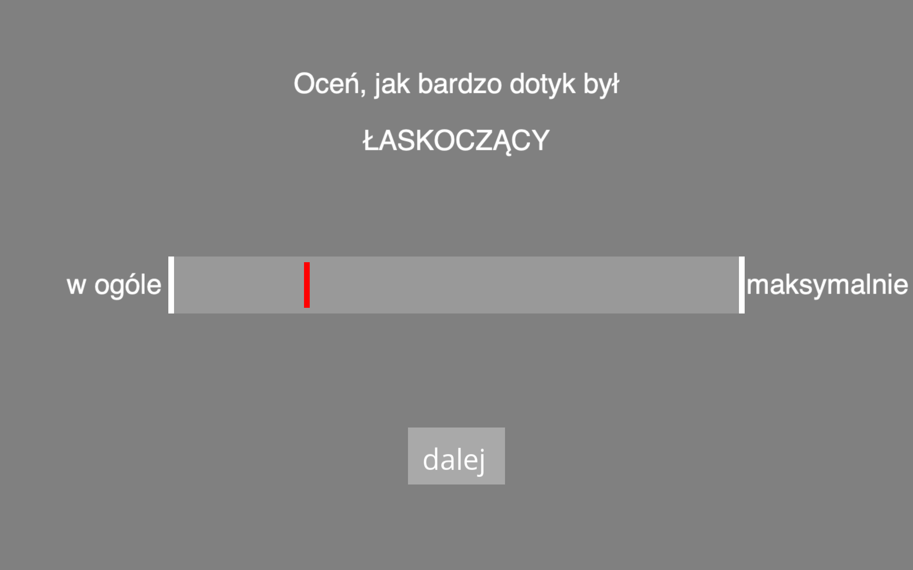

# Zbieranie demografii {#lab04}

:::{.box}

**LITERATURA**

***Załącznik B. Tworzenie Kwestionariuszy*** z podręcznika Shaughnessy, J. J., Zechmeister, E. B., & Zechmeister, J. S. (2002). Metody badawcze w psychologii. Gdańskie Wydawnictwo Psychologiczne.

:::

:::{.box}

**WASZE ZADANIE**

Stwórzcie kwestionariusz demograficzny.

W każdym badaniu musicie zebrać podstawowe informacje demograficzne na temat osób badanych. Zastanówcie się, jakich informacji o Waszych badanych będziecie potrzebować. Uwaga: każda z grup z całą pewnością będzie musiała zapytać o płeć i wiek. Sprawdźcie, jakie jeszcze informacje o badanej grupie raportują autorzy badań, na których się wzorujecie, prawdopodobnie Wy również powinniście je zebrać (o ile możecie to zrobić ze względów formalnych). Informacje o zadanych pytaniach i charakterystyce próby i znajdziecie w części metodologicznej i wynikowej. 

Ważne: przynieście na zajęcia artykuły, na podstawie których decydowaliście, jakie informacje demograficzne będziecie zbierać.  

:::

Zadając pytania w kwestionariuszach, pamiętajcie by kierować się poniższymi wskazówkami.

1. Kiedy badani udzielają odpowiedzi na Twoje pytanie, dostajesz dane, których już nie będziesz miał(a) szansy uzupełnić. Po rozpoczęciu badania nie zmienisz też formy odpowiedzi. Pamiętaj o tym formułując pytanie. Przykład: jeżeli zadasz pytanie o wiek pytając o przynależność do grup wiekowych, to nie dasz rady policzyć korelacji dowolnej zmiennej z wiekiem, nie zmienisz również granic grup wiekowych.
2. Twoje pytania powinny mieć sens dla każdego z potencjalnych badanych. Np. to pytanie na lokalnym portalu [kliknij!](https://www.trojmiasto.pl/ankiety/Czy-po-przyjezdzie-do-Oliwy-masz-problem-z-parkowaniem-ank59275.html) nie ma żadnego sensu dla osób, które w ogóle nie mają problemu z parkowaniem w Oliwie albo dla tych, które od zawsze mają takie same problemy...
3. Pytania powinny być zrozumiałe. Dlatego:
  - używaj prostego słownictwa;
  - unikaj żargonu; 
  - twórz krótkie pytania;
  - unikaj podwójnych zaprzeczeń.
Warto przetestować pytania na kimś znajomym, zanim udostępnisz je badanym.
4. Unikaj zaprzeczeń, kiedy tylko to możliwe. Dlaczego? Przykład: jak odpowiedział(a)byś na stwierdzenie "Nie lubię kalafiora", gdyby możliwymi odpowiedziami były "tak" i "nie"? Co znaczyłaby w tej sytuacji odpowiedź "nie"?
5. Pytania powinny dotyczyć jednej kwestii! Inaczej badani mogą mieć problem z udzieleniem odpowiedzi, a Ty potem będziesz miał(a) problem z jej interpretacją. Przykład źle sformułowanego pytania: "Czy uważasz, że rząd powinien wydawać mniej pieniędzy na zbrojenia, a więcej na edukację?".
6. Unikaj tendencyjnych, sugerujących pytań!
7. Uważaj na gramatykę, ortografię i interpunkcję!

:::{.box}

Źle zadane pytania mają nawet swoje miejsce na twitterze. Bawcie się dobrze :)

[https://twitter.com/badsurveyq](https://twitter.com/badsurveyq)
:::

## Rodzaje pytań {#lab-04-rodzaje}

W ankietach, kwestionariuszach i testach psychologicznych możecie spotkać się z różnymi rodzajami pytań. 

**Pytania otwarte.** O ile nie pytacie o liczbę, analiza odpowiedzi w takich pytaniach jest pracochłonna. Odpowiedzi wymagają kategoryzacji lub innego sposobu jakościowej analizy i musicie być pewni, że nie zniekształcicie w ten sposób uzyskanych wyników. 

Ile ma Pan/Pani lat?
Proszę wypisać nazwy stron i serwisów interentowych, z których korzysta Pan(i) codziennie.
Proszę o wypisanie cech, które charakteryzują Pana/i dziecko.

**Pytania wymagające wybrania JEDNEJ odpowiedzi z kafeterii**

Jakie ma Pan/Pani wykształcenie?  
  a) podstawowe  
  b) zasadnicze zawodowe  
  c) średnie  
  d) wyższe  

Jak duża jest miejscowość, w której mieszkasz?  
  a) wieś  
  b) miasto poniżej 20 tys. mieszkańców  
  c) miasto 20-100 tys. mieszkańców  
  d) miasto 100-200 tys. mieszkańców  
  e) miasto 200-500 tys. mieszkańców  
  f) miasto powyżej 500 tys. mieszkańców  

*Na jaki problem mogą napotkać respondenci odpowiadając na powyższe pytania? Jak można rozwiązać te problemy?*

W Diagnozie Społecznej [http://www.diagnoza.com](http://www.diagnoza.com) w niektórych pytaniach dotyczących wykształcenia stosowana jest następująca kafeteria:

  0. Niepełne podstawowe
  1. Podstawowe
  2. Zawodowe
  3. Niepełne średnie
  4. Średnie zawodowe
  5. Średnie ogólnokształcące
  6. Niepełne wyższe (w tym pomaturalne)
  7. Wyższe

**Pytania dopuszczające wybranie WIELU odpowiedzi z kafeterii**

Które z wymienionych form aktywności fizycznej podejmowałeś/aś w ciągu ostatnich 7 dni?
  1. spacery  
  2. bieganie  
  2. pływanie  
  3. jazda na rowerze  
  4. nordic-walking  
  5. fitness  
  6. jazda na rolkach  

*Czy dodalibyście do tego pytania pozycję "inne"?*

**Pytania z odpowiedzią na wielostopniowej skali**

Wielostopniowa skala odpowiedzi pozwala badanemu na określenie, w jak dużym stopniu zgadza się on z podanym twierdzeniem. Przykładem takiego pytania jest np. pozycja ze skali Ten Item Personality Inventory [@gosling2003very], w polskim przekładzie A. Sorokowskiej i wsp. [-@sorokowska2014polska]:

Spostrzegam siebie jako osobę lubiącą towarzystwo innych, aktywną i optymistyczną.

1. zdecydowanie nie zgadzam się  
2. nie zgadzam się 
3. raczej nie zgadzam się
4. trudno powiedzieć
5. raczej zgadzam się  
6. zgadzam się 
7. zdecydowanie zgadzam się

Skalę złożoną z tego typu pytań, w której badani swoją postawę, nazywa się skalą Likerta. Pozycje w skali Likerta powinny spełniać kilka założeń, zainteresowanych odsyłam do podręcznika, z którego korzystamy na zajęciach [@shaughnessy2002metody], s. 152 lub tutaj: [https://kpu.pressbooks.pub/psychmethods4e/chapter/constructing-surveys/](https://kpu.pressbooks.pub/psychmethods4e/chapter/constructing-surveys/). Często określenia "skala Likerta" używa się do określenia skali odpowiedzi w pojedynczych pozycjach (pytaniach) takich jak powyższe, ale jest to skrót myślowy i lepiej posłużyć się po prostu określeniem np. "skala siedmiostopniowa".

Wielostopniowe skale odpowiedzi powinny być zrównoważone, tzn. powinny zawierać tyle samo pozycji pozytywnych i negatywnych. Niekiedy autorzy decydują się na użycie skali o parzystej liczbie pozycji, czyli pozbawionej odpowiedzi neutralnej. Takie rozwiązanie ma zarówno zalety, jak i wady.


**Pytania z wykorzystaniem wizualnej skali analogowej**

Wizualna skala analogowa wymaga od badanego zaznaczenia odpowiedzi na continuum między dwoma skrajnościami. Możemy w ten sposób zapytać np. o nasilenie odczuwanego bólu. Przykład wizualnej skali analogowej widoczny jest na obrazku poniżej.

```{r vas, fig.cap="Przykład wizualnej skali analogowej."}

```


### Szczególne zagadnienia dotyczące pytań z kafeterią

*Warto niekiedy dodać opcję "inne", najlepiej z możliwością wpisania o jakie inne chodzi. Pamiętajcie jednak, że jeśli Wasza kafeteria nie będzie wyczerpująca, to porównywanie częstości występowania odpowiedzi wymienionych w kafeterii i zaliczonych do jakichś kategorii na podstawie opisu w pozycji "inne" jest bardzo ryzykowne. Czy wiecie dlaczego?*

**Ciekawa kwestia kolejności w kafeterii.** W pytaniu takim jak powyżej przydatna może okazać się losowa rotacja pozycji w kafeterii. Pozwoli to uniknąć sytuacji, w której pierwsze pozycje w kafeterii są zaznaczane częściej niż pozostałe nie dlatego, że rzeczywiście powinno tak być, ale dlatego, że są na początku. Ma to znaczenie szczególnie w przypadku pytań z długą kafeterią, w których respondenci mogą poświęcać mniej uwagi końcowym pozycjom.

**Nie wiem, trudno powiedzieć.** Jeżeli tylko macie podejrzenia, że respondenci mogą mieć trudność z odpowiedzią na pytanie, zastanówcie się nad dodaniem opcji "nie wiem" albo "trudno powiedzieć". Pamiętajcie, że w pytaniach o fakty (np. wielkość mniejscowości zamieszkania) brak takiej opcji może spowodować, że dostaniecie odpowiedź niedokładną albo całkowicie losową.

**Odmawiam odpowiedzi.** Jeżeli tylko podejrzewacie, że jakieś pytanie może wzbudzić opór badanych, dodajcie opcję "odmawiam odpowiedzi". Zawsze lepiej stracić odpowiedź w jednym pytaniu, niż całą ankietę.


