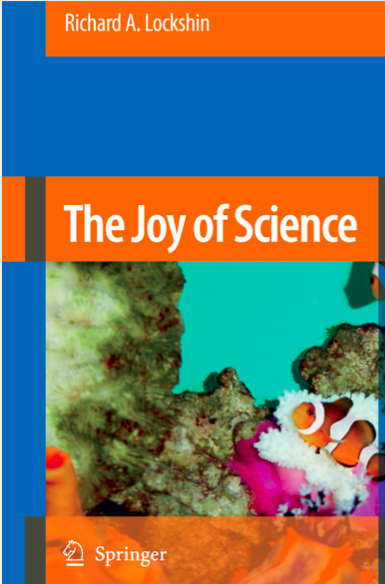
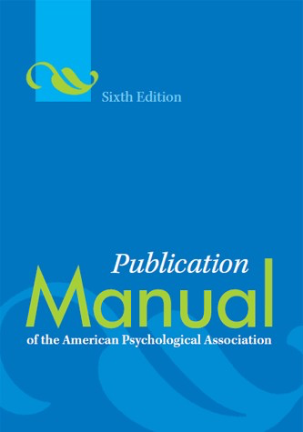
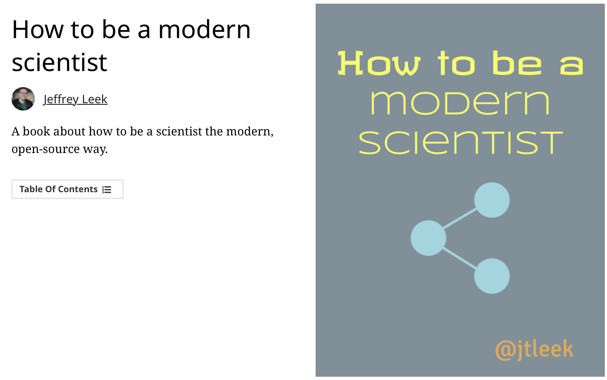

---
title: Metodologia Badań Psychologicznych
---

# Podstawowe informacje

## Skąd do Was przybywam ;)

Małgorzata Basińska  
Zakład Badań nad Jakością Życia  
Katedra Psychologii  
ul. Tuwima 15

## Jak się ze mną kontaktować

- Mailowo: mbas@gumed.edu.pl
- Konsultacje - środa 14.00-15.30 (proszę o wcześniejszy kontakt mailowy)

# Podręczniki

## Podręcznik 1

## Podręcznik 2

## Jeszcze inny podręcznik

## Jeszcze inny podręcznik

## APA Manual

## Źródła on-line

# Format zajęć i zaliczenie

## Co będzie na

- wykładach
- ćwiczeniach
- laboratoriach

## Cztery szerokie zagadnienia na wykładach

- psychologia jako nauka
- naukowy ekosystem
- podstawowy warsztat metodologiczny
- podstawy etyki w badaniach psychologicznych 

## Zaliczenie

- To jest roczny przedmiot (dokładne warunki zaliczenia niebawem na stronie przedmiotu)
- W tym semestrze 2 kolokwia na wykładzie, zadanie zaliczeniowe i prezentacja na ćwiczeniach/laboratoriach

# Główne cele

## Po zajęciach

- Powinniście umieć odróżnić teorie naukowe od pseudonaukowych, wiedzę o rzetelnych podstawach od informacji i praktyk, które naukowej podstawy nie posiadają
- Posiadać podstawowy warsztat, który pomoże Wam realizować własne badania

  

