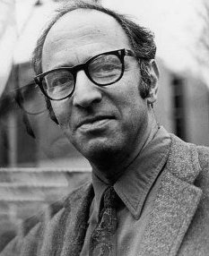
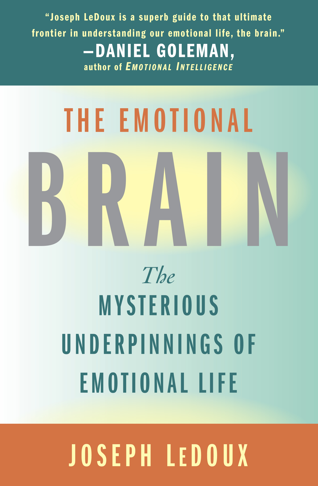

# Słowem przypomnienia

## Krytyczna ocena teorii naukowych

- Teorię można ocenić pod kątem:
  - logicznej spójności
  - przyjętych założeń
  - mocy wyjaśniania
  - falsyfikowalności

## Teorie naukowe a poznanie świata

- Teorie naukowe determinują sposób, w jaki opisujemy obserwowane zjawiska (w obrębie jednej teorii).
- Można powiedzieć, że weryfikując hipotezy sprawdzamy, czy nasza teoria wytrzymuje konfrontację z rzeczywistością.

# Paradygmaty

## Thomas Samuel Kuhn (1922-1996)

:::::::::::::: {.columns}
::: {.column width="50%"}

:::
::: {.column width="50%"}
- Amerykański fizyk, historyk, filozof nauki. 
- Autor książki *The Structure of Scientific Revolutions* (1962)
:::
::::::::::::::

<small>Photographer: Bill Pierce (Time Life Pictures/Getty Images), fair use </small>

## Rozwój nauki - propozycja T. Kuhna

- Wcześniej sądzono, że rozwój nauki przebiega poprzez akumulację wiedzy
- Kuhn dowodzi, że w nauce dochodzi do rewolucji, zwanych zmianami paradygmatów (paradigm shift)

## Paradygmaty

Paradygmat to ogólnie uznawany (w danym momencie) model problemów i rozwiązań, który dla grupy naukowców definiuje:

- Co powinno być badane
- Jakiego rodzaju pytania mogą być zadawane
- Jaka jest struktura takich pytań
- Jaka jest podstawowa teoria w danej dziedzinie
- Jak należy interpretować wyniki
- W jaki sposób i jakimi metodami przeprowadzać badania

## Czy w psychologii były już kiedyś rewolucje?

- Behawioryzm: nie mamy dostępu do umysłu, więc go nie badamy - skupiamy się na badaniu zachowania, które opisujemy w kategoriach bodźców i reakcji

----------

>John B. Watson: "Give me a dozen healthy infants, well-formed, and my own specified world to bring them up in and I'll guarantee to take any one at random and train him to become any type of specialist I might select – doctor, lawyer, artist, merchant-chief and, yes, even beggar-man and thief, regardless of his talents, penchants, tendencies, abilities, vocations, and race of his ancestors. I am going beyond my facts and I admit it, but so have the advocates of the contrary and they have been doing it for many thousands of years."

--------

- Rewolucja poznawcza:
  + Noam Chomsky: *Syntactic structures* (1957), krytyka poglądu Skinnera na język (1959)
  + George Miller: *Magical Number Seven, Plus Minus Two* (1956)
  + Jerry Bruner i wsp.: strategie poznawcze w *A Study of Thinking* (1956)
  + i wielu, wielu innych, i Europa w natarciu! (m.in. F. Bartlett, J. Piaget, A.R. Łuria)
  
## To dobry moment by wspomnieć o Jerzym Konorskim (1903-1973)

<small>Autor zdjęcia nieznany, foto opublikowane w Andrzej Trzebski: “Jak pracuje mózg”. Kultura, 6 stycznia 1974 s. 4</small>

## Kolejna rewolucja? Poznawcza neuronauka

{#id .class height=350px}

## Kolejna rewolucja? Poznawcza neuronauka

{#id .class height=350px}

Minds without emotions are not minds at all  
Umysły bez emocji nie są wcale umysłami

## Kolejna rewolucja?

- Poznanie i percepcja są procesami, podczas których tworzone są predykcje (przewidywania)
- Poznanie jest procesem aktywnym, zależnym od działania organizmu w otaczającym go świecie
- To, jak skonstruowany jest ten organizm odgrywa istotną rolę percepcji, rozumowaniu i procesach intelektualnych

## Paradygmaty w psychologii

- ewolucyjny
- poznawczy
- teorii uczenia się
- społeczno-kulturowy
- rozwojowy

*lista nie jest wyczerpująca*

## Wszystkie te paradygmaty mają wspólną część

I to o niej uczymy się na metodologii :)

