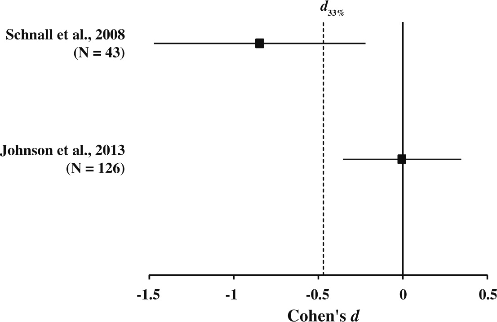

# Etapy procesu badawczego w psychologii

## Kontekst

## Etapy

## Nasz przykładowy eksperyment

[https://www.youtube.com/watch?v=NyDDyT1lDhA](https://www.youtube.com/watch?v=NyDDyT1lDhA)

# Hipotezy

## Praca naukowa jako weryfikacja hipotez

- Istotą pracy naukowej jest weryfikacja hipotez postawionych na podstawie teorii.
- Hipotezy muszą opierać się na dobrze zdefiniowanych pojęciach i podlegać empirycznej weryfikacji.
- Zaprzeczenie hipotezy również powinno być możliwe do zaobserwowania.
- Z góry powinniśmy wiedzieć, kiedy hipotezę przyjmiemy, a kiedy odrzucimy.

## Dobra hipoteza

- falsyfikowalna
- uzasadniona i logiczna (wynikająca logicznie z dostępnej wiedzy)
- pozytywna (tzn. mówiąca o związku a nie jego braku)

<small>Na podstawie: Research Methods in Psychology by Rajiv S. Jhangiani, I-Chant A. Chiang, Carrie Cuttler, & Dana C. Leighton [link](https://kpu.pressbooks.pub/psychmethods4e/chapter/developing-a-hypothesis/) </small>

## Stawianie hipotez

- Hipoteza badawcza - konkretna, falsyfikowalna predykcja na temat związku pomiędzy dwiema lub więcej *zmiennymi*
- Związek postulowany przez hipotezę *nie zawsze będzie związkiem przyczynowym*!
- Najprostsze hipotezy łączą dwie zmienne, ale zmiennych może być więcej

## Hipotezy kierunkowe

- Hipoteza zakłada *związek* pomiędzy zmiennymi, może mówić również o *kierunku* tego związku...
- ...i wtedy jest to hipoteza kierunkowa

## Przykłady hipotez badawczych

- Wystąpienie stresującego zdarzenia o charakterze interpersonalnym wiąże się z podwyższonym ryzykiem podjęcia próby samobójczej tego samego lub kolejnego dnia
- Wysoki poziom lęku wiąże się z krótszym zwlekaniem z podjęciem leczenia onkologicznego
- Słuchanie muzyki *zmniejsza* natężenie odczuwanego bólu
- Słuchanie muzyki *zwiększa* natężenie odczuwanego bólu

## Kiedy będziemy zmuszeni odrzucić naszą hipotezę

- Musimy wiedzieć to *zanim* rozpoczniemy badania i uzyskamy wyniki
- Pomagają nam w tym *metody statystyczne* i przyjęte poziomy ufności
- Powody dla których badanie "nie wychodzi" - jakie?

## Replikacja - próbujemy powtórzyć wcześniejsze badanie

<small>Johnson, D.J., Cheung, F. and Donnellan, M.B. (2014). Does Cleanliness Influence Moral Judgments? Social Psychology, 45(3), 209-215. [link](https://econtent.hogrefe.com/doi/full/10.1027/1864-9335/a000186) Fair use.</small>

## Powody, dla których nie obserwujemy spodziewanego efektu

- efektu nie ma (a przynajmniej nie ma go w tej konkretnej sytuacji)  
- efekt jest, ale niewielki - okazałby się *istotny statystycznie* na większej grupie, ale uwaga: co mówi nam o świecie niewielki efekt?

-------------------

- coś źle robimy - warsztat badacza
- robimy coś inaczej, niż autorzy, którzy zaobserwowali wcześniej interesujący nas efekt [tu przykład (na początku)](https://www.nature.com/articles/d41586-020-02142-6)  
- próbujemy zreplikować zdawkowo opisane badanie lub korzystamy z metody, która była nieprecyzyjnie opisana (czyli robimy coś nie tak, ale nie wiemy co, bo autor nie podzielił się tym z nami) 

## Systematyczny przegląd i metaanaliza

Właśnie te dwa rodzaje artykułów naukowych pozwalają nam mierzyć się ze wspomnianymi problemami.

## Etapy

## Czy tak łatwo określić granicę odrzucenia hipotezy

[Wyniki eksperymentu Ascha](https://play.google.com/books/reader?id=DGjQAAAAMAAJ&hl=en&pg=GBS.PA181)

# Zmienne i definicje

## Definicje w badaniach

- Weryfikacja hipotez nie jest możliwa bez definicji obserwowanych zjawisk.
- Nie wszystkie pojęcia (zmienne konceptualne) można wprost badać empirycznie.
- Przykłady - inteligencja, osobowość, poczucie kontroli.
- Jak zdefiniowalibyście *konformizm*?

## Definicja konformizmu w eksperymencie Ascha

>Naszym bezpośrednim celem było zbadanie społecznych i osobowych uwarunkowań, które skłaniają jednostki do **oparcia się lub poddania presji grupy, podczas gdy jest ona postrzegana jako niezgodna z faktami**.
>  
>Our immediate object was to study the social and personal conditions that induce individuals to **resist or to yield to group pressures when the latter are perceived to be contrary to fact**. 
>
<small>Asch, S.E. (1951). Effects of group pressure on the modification and distortion of judgments. In H. Guetzkow (Ed.), Groups, leadership and men (177–190). Pittsburgh, PA:Carnegie Press. [link](https://play.google.com/books/reader?id=DGjQAAAAMAAJ&hl=en&pg=GBS.PA181)
</small>

## Operacjonalizacja

- By nadać sens empiryczny pojęciom, którymi się posługujemy, stosujemy tzw. *definicje operacyjne*. 
- Operacjonalizacja to definiowanie zmiennej przez pryzmat obiektywnych, empirycznych wskaźników.
- Np. inteligencję można zdefiniować operacyjnie odwołując się do narzędzi służących do jej badania (wynik testu na inteligencję) [@shaughnessy].
- Jaka była definicja operacyjna oparcia lub poddania się presji grupy w eksperymencie Ascha?

## Definicja operacyjna w eksperymencie Ascha

>Zastosowaliśmy procedurę umieszczania osoby w sytuacji radykalnego konfliktu ze wszystkimi pozostałymi członkami grupy, mierzenia wywieranego przez tę sytuację efektu w terminach ilościowych i opisywania psychologicznych konsekwencji tej sytuacji. Grupa ośmiu osób została poinstruowana, by ocenić serię prostych, jasno określonych relacji percepcyjnych (...). 

-------------

>Każdy członek grupy wygłaszał swoje oceny publicznie. W środku tego monotonnego "testu" jedna osoba nagle znajdowała się w sytuacji sprzeczności wobec całej grupy i ta sprzeczność była powtarzana ponownie i ponownie w trakcie eksperymentu. Omawiana grupa, z wyłączeniem jednego jej członka, spotkała się wcześniej z eksperymentatorem i otrzymała instrukcje, by w pewnych momentach odpowiadać dokonując błędnych - i jednogłośnych - ocen. 
>
--------

>[...] Zastosowana technika pozwoliła uzyskać prostą ilościową miarę "efektu większości" w terminach częstości błędów o kierunku odpowiadającym zniekształconym ocenom większości.
> 
<small>Asch, S.E. (1951). Effects of group pressure on the modification and distortion of judgments. In H. Guetzkow (Ed.), Groups, leadership and men (177–190). Pittsburgh, PA:Carnegie Press. [link](https://play.google.com/books/reader?id=DGjQAAAAMAAJ&hl=en&pg=GBS.PA181) Własny przekład
</small>

## Przykład: operacjonalizacja depresji

- wynik w teście depresji (papier-ołówek, ocena stwierdzeń na skali), np. wynik w Skali Depresji Becka
- liczba symptomów (objawów) depresji
- diagnoza depresji w przeszłości

<small>Za: Research Methods in Psychology by Rajiv S. Jhangiani, I-Chant A. Chiang, Carrie Cuttler, & Dana C. Leighton [link](https://kpu.pressbooks.pub/psychmethods4e/chapter/developing-a-hypothesis/) </small>

## Praktyczna uwaga

- operacjonalizujcie zmienne w uznany w danej dziedzinie sposób!!!!!!!!! 
- robienie rzeczy po swojemu jest fajne i ciekawe, ale _***BARDZO***_ dużo pracy wymaga robienie rzeczy po swojemu i jednocześnie dobrze - musicie przekonać innych, że rzeczywiście jest dobrze
- możecie narazić się na zarzut braku trafności zastosowanych narzędzi (o trafności zaraz)

## Zmienne

- Zmienna -  jakakolwiek własność lub cecha, która przyjmuje różne wartości u różnych ludzi, w różnych sytuacjach etc.
- Przykłady:
    - Wiek
    - Płeć
    - Nastrój
    - Agresywność
    - Inteligencja
    - Neurotyzm
    
## Zmienne jakościowe i ilościowe

- przykłady zmiennych jakościowych (kategorialnych), czyli takich, które reprezentują pewną charakterystykę osób badanych i pozwalają przypisać ich do określonej grupy (kategorii):
  + kierunek studiów
  + zawód
  + korzystanie z psychoterapii w przeszłości
- przykłady zmiennych ilościowych, czyli takich, które pozwalają każdej osobie przypisać pewną liczbową wartość tej zmiennej:
  + wzrost
  + wiek
  + liczba rodzeństwa

## Zmienne zależne i niezależne

- *Zmienne niezależne* to te, którymi badacz manipuluje lub które kontroluje w swoim badaniu.
  + Zmienne, którymi manipulujemy w eksperymentach (warunki eksperymentalne / warunek kontrolny).
  + Zmienne o charakterze różnic indywidualnych (naturalne zmienne grupowe).
- *Zmienne zależne* to te, w przypadku których weryfikujemy czy ich poziom jest różny, gdy różni się poziom zmiennej niezależnej. Jeżeli możemy sami manipulować zmienną niezależną sprawdzamy, czy podlegają zmianie, jeżeli to robimy.

# Jak wygląda nasze badanie

## Ile osób badanych?

- Decyzję o tym, ile osób zbadamy musimy podjąć *przed* rozpoczęciem badań.
- Inaczej ryzykujemy, że ktoś zarzuci nam, niekiedy słusznie, że badaliśmy aż zaobserwowaliśmy zgodny z hipotezą efekt.

## Grupa kontrolna

- By zweryfikować jakąkolwiek hipotezę, potrzebujemy *grupy kontrolnej*.
- Co moglibyśmy powiedzieć bez grupy kontrolnej i dlaczego niewiele
  - [Wyniki eksperymentu Ascha](https://play.google.com/books/reader?id=DGjQAAAAMAAJ&hl=en&pg=GBS.PA181)

## Narzędzia

- Powinny pozwalać nam zmierzyć to, co w istocie chcieliśmy zmierzyć (trafność)
- Powinny mierzyć to możliwie dokładnie (rzetelność)

# Podstawowe rodzaje badań w psychologii

## Prosty podział wg dwóch kryteriów

- Czy to my manipulujemy zmienną niezależną?
- Czy to my kontrolujemy dobór do grup?

## Kontrolujemy zmienną niezależną, kontrolujemy dobór do grup

- Eksperyment "właściwy", np. eksperyment Ascha
- Co się stanie, jeżeli źle dobierzemy osoby do grup i grupy wyjściowo będą się różnić?

## Manipulujemy zmienną niezależną, nie kontrolujemy doboru do grup

- Quasi-eksperyment, np. badanie Langer i Rodin dotyczące wzbudzania odpowiedzialności
- Znajdujemy w świecie dwie naturalnie występujące grupy, które nie powinny różnic się pod względem badanej zmiennej, w podanym przykładzie osoby mieszkające w domu opieki na dwóch różnych piętrach
- Dokonujemy manipulacji eksperymentalnej i mierzymy jej efekty porównując te grupy
- Niebezpieczeństwo: osoby w obydwu grupach mogły różnić się jeszcze zanim podjęliśmy badania!

## Nie manipulujemy zmienną niezależną, nie kontrolujemy doboru do grup

- porównanie grup, np. ryzyko podejmowane przez kobiety i mężczyzn podczas zmierzania na autobus
- badania korelacyjne, np. związek między różnymi cechami osobowości
- plany:
  + badania poprzeczne
  + sukcesywnych prób niezależnych
  + badania podłużne

## Gdy nie kontrolujemy doboru do grup

- Nie mamy wpływu na zmienne zakłócające związane z charakterystyką badanych i ich historią
- W efekcie nie możemy w pełni przypisać obserwowanego efektu zmieniającym się poziomom zmiennej niezależnej

## Gdy nie manipulujemy sami zmienną niezależną

- Nie mamy żadnej gwarancji, że nie zaszły inne równie / bardziej istotne zmiany
- Nie możemy w związku z tym na podstawie naszego badania wnioskować o zależności przyczynowo-skutkowej między zmiennymi

# Podsumowanie

## W skrócie

- Teoriom w nauce towarzyszą paradygmaty, które określają, jakie problemy podejmowane są w danej dziedzinie i jak wyglądają badania, które na te problemy odpowiadają.
- Realizując badania empiryczne korzystamy z definicji operacyjnych zmiennych, do których odnoszą się nasze hipotezy.
- Lwią część pracy badawczej wykonujemy tak naprawdę, *zanim* rozpoczniemy badania.

## Literatura

<small>