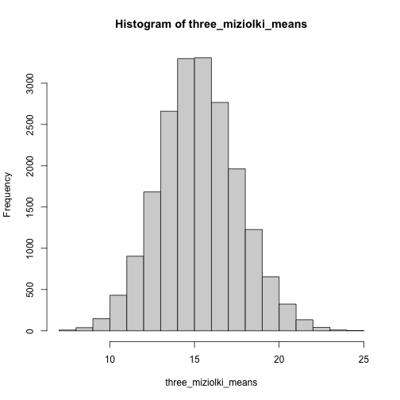

# Słowem przypomnienia

## Próba i populacja

- *Populacja* to ogół osób, do których odnosi się dana teoria (np. populacja wszystkich ludzi, populacja kobiet, populacja niemowląt).
- *Próba* to ta część populacji, którą objęliśmy badaniem

## WAŻNE! Hipoteza zerowa i populacja

- Nie mamy możliwości zbadania całej populacji - badamy próbę....
- ...ale chcemy wnioskować na temat całej populacji.
- To właśnie populacji dotyczy nasza hipoteza zerowa!!!
- I chcemy uzyskać wynik istotny statystycznie, czyli taki, który pozwala odrzucić hipotezę zerową.

## ALE UWAGA: nawet jeżeli między jakimiś dwoma populacjami nie ma żadnych różnic, wylosujemy próbę poprawnie, bez żadnego obciążenia, to możemy w badaniu zaobserwować różnicę między próbami wylosowanymi z tych populacji.

# Bardzo prosty przykład na to, że nawet jeżeli w populacji nie ma różnic między grupami, możemy w badaniu taką różnicę znaleźć

## Nasza populacja

Wyobraźcie sobie, że mamy populację 100 reniferów Świętego Mikołaja, w której jest 50 **miziołków** i 50 **buziołków**. Średni czas, w jakim renifery mogą dostarczyć worek prezentów z Rovaniemi i Gdańska jest taki sam, niezależnie od odmiany (miziołki / buziołki). 

------------

*UWAGA: w miejsce **miziołków** i **buziołków** możesz wstawić dowolne insteresujące Cię grupy :) w miejsce **czasu dostarczenia prezentu** możesz wstawić dowolną cechę.*

## Miziołek

{height=350px}

<small>Autor: Are G Nilsen, Licencja: [CC BY-SA 3.0](https://creativecommons.org/licenses/by-sa/3.0), ściągnięte z [wikipedii](https://en.wikipedia.org/wiki/Reindeer#/media/File:Reinbukken_på_frisk_grønt_beite._-_panoramio.jpg)</small>

## Buziołek

{height=350px}

<small>Autor: Ludovic Rivallain, Licencja: [CC BY-SA 3.0](https://creativecommons.org/licenses/by-sa/3.0), ściągnięte z [wikipedii](https://en.wikipedia.org/wiki/Reindeer#/media/File:Rennes_d'élevage,_mais_en_liberté,_près_de_Suomussalmi._-_panoramio.jpg)</small>

## Rozkład wyników - miziołki

## Rozkład wyników - buziolki

## Podstawowe statystyki w obydwu grupach

- Średnia: 15.42
- Odchylenie standardowe: 4.1849585
- Minimum: 6
- Maximum: 27

## Na ile sposobów możemy wybrać 3 z 50 miziołków / buziołków?

::: incremental

19600

:::

## Jaka będzie średnia dla 3 z 50 miziołków / buziołków?

## Średia i odchylenie standardowe tych średnich

- Średnia: 15.42
- Odchylenie standardowe: 2.3426399

## Na ile sposobów możemy wybrać 5 z 50 miziołków / buziołków?

::: incremental

- Na 2118760 sposobów

:::

## Jaka będzie średnia dla 5 z 50 miziołków / buziołków?

## Średia i odchylenie standardowe tych średnich

- Średnia: 15.42
- Odchylenie standardowe: 1.7755279

## Na ile sposobów możemy wybrać 7 z 50 miziołków / buziołków?

::: incremental

- Na 99884400 sposobów

:::

## Jaka będzie średnia dla 7 z 50 miziołków / buziołków?

*Stworzenie 99884400 7 elementowych zbiorów wybranych z 50 elementowego zbioru miziołków i policzenie średniej dla każdego trwało tak długo, że nie chciało mi się czekać...*

## Skupmy się na badaniu, w którym losujemy 3 miziołki i 3 buziołki

## Jakie jest prawdopodobieństwo, że w naszym badaniu, gdzie n = 3 wystąpi średnia mniejsza od 10 albo większa od 20?

- Średnia mniejsza od 10: 0.0063265
- Średnia większa od 20: 0.0261735

## A jakie jest prawdopodobieństwo takiego scenariusza?

- Wylosowaliśmy trzy miziołki i uzyskaliśmy dla nich średnią mniejszą od 10.
- Wylosowaliśmy trzy buziołki i uzyskaliśmy dla nich średnią większą od 20.
- Pamiętamy, że grupy tak naprawdę się nie różnią i dla obydwu średnia jest równa około 15!!!!

---------

0.0001656

## A jakie jest prawdopodobieństwo takiego scenariusza?

- Wylosowaliśmy trzy miziołki i uzyskaliśmy dla nich średnią mniejszą od 13.
- Wylosowaliśmy trzy buziołki i uzyskaliśmy dla nich średnią większą od 17. 

## mean < 13 & mean > 17

- Średnia mniejsza od 13: 0.13
- Średnia większa od 17: 0.2222449
- Prawdopodobieństwo, że dla miziołków średnia < 13, a dla buziołków > 17: 0.0288918

## A jakie jest prawdopodobieństwo takiego scenariusza?

- Wylosowaliśmy trzy miziołki i uzyskaliśmy dla nich średnią mniejszą od 13,5.
- Wylosowaliśmy trzy buziołki i uzyskaliśmy dla nich średnią większą od 16,5. 

## mean < 13,5 & mean > 16,5

- Średnia mniejsza od 13,5: 0.2038265
- Średnia większa od 16,5: 0.3122959
- Prawdopodobieństwo, że dla miziołków średnia < 13,5, a dla buziołków > 16,5: 0.0636542

## Ok, a co jeżeli zbadaliśmy więcej reniferów? Np. 5?

W naszym przykładzie w rzeczywistości nie ma różnic między miziołkami i buziołkami. Czy prawdopodobieństwo, że zaobserwujemy różnicę na poziomie 3 punktów będzie większe czy mniejsze, kiedy zbadamy więcej reniferów (5 zamiast 3)?

--------------------

- Średnia mniejsza od 13,5: 0.139121
- Średnia większa od 16,5: 0.2681139
- Prawdopodobieństwo, że dla miziołków średnia < 13,5, a dla buziołków > 16,5: 0.0373003

## 3 vs 5 reniferów w grupie

|Średnie w grupach|3 renifery|5 reniferów|
|-|-|-|
|10 i 20|0.0001656|0.000002|
|13 i 17|0.0288918|0.0130105|
|13,5 i 16,5|0.0636542|0.0373003|

## Wnioski z tej prostej symulacji

- Nawet jeżeli dwie grupy się nie różnią, możemy w badaniu uzyskać jakąś różnicę między wylosowanymi z nich próbami.
- Jesteśmy w stanie oszacować prawdopodobieństwo wystąpienia różnicy o określonej wielkości przy założeniu, że dwie grupy się nie różnią (choć w praktyce jest to nieco bardziej skomplikowane niż w podanym przykładzie).

---

- Im mniejsza różnica (słabsza zależność), tym większe prawdopodobieństwo, że ją uzyskamy w badaniu w sytuacji, w której w populacji nie ma różnic między grupami.
- Im więcej osób w naszej próbie, tym mniejsze prawdopodobieństwo, że zaobserwujemy różnicę **określonej wielkości** w sytuacji, w której w populacji nie ma różnic między grupami.

# Wartość *p*

## Co to takiego

- Wartość *p* (*p value*), z którą stykacie się analizując wyniki badań, oznacza prawdopodbieństwo z jakim obserwowany w badaniu wynik mógł pojawić się w sytuacji, w której dana zależność w populacji nie występuje (czyli w podobnej do przedstawionej w przykładzie z reniferami).

## Czego nam NIE mówi wartość p?

- Jakie jest prawdopodobieństwo, że H0 jest prawdziwa.
- Jakie jest prawdopodobieństwo, że zaobserwowana różnica odzwierciedla "prawdziwą" różnicę dla populacji.
- Że wynik jest ważny / znaczący z praktycznego lub klinicznego punktu widzenia.
- Czy replikacja badania również dostarczy istotnych wyników i jakie jest prawdopobieństwo takiego scenariusza.

-------

Wartość p nie mówi, jak silna jest badana zależność! Większe p nie oznacza silniejszego związku!

## Nieistotny wynik nie oznacza, że zależność, którą badamy nie występuje w populacji!

- Mogliśmy zrobić badanie o niewystarczającej mocy, zbadać zbyt mało osób.

# Przebieg rozumowania statystycznego

# Podsumowanie

## Ważny wniosek

- Jeżeli w interesującej nas populacji nie ma żadnej różnicy między dwoma grupami, możemy zaobserwować taką różnicę nawet w doskonale zaprojektowanym badaniu.
- Dzieje się tak dlatego, że nie badamy całej populacji, a jedynie jej niewielką część (próbę) i może wystąpić sytuacja, w której nawet gdy dana różnica w populacji nie występuje, do naszej próby trafią badani, którzy się różnią... bo tak wyszło.

------

- To, jak duże jest prawdopodobieństwo, że obserwowana przez nas różnica między grupami mogła pojawić się w sytuacji, w której w populacji nie ma różnic, określa *wartość p*.

## Praktyczne pytania, które odbiorca badania powinien sobie zadać

- Jaki jest poziom istotności statystycznej uzyskanych wyników? Czy dla Ciebie, jako odbiorcy badania jest satysfakcjonujący?
