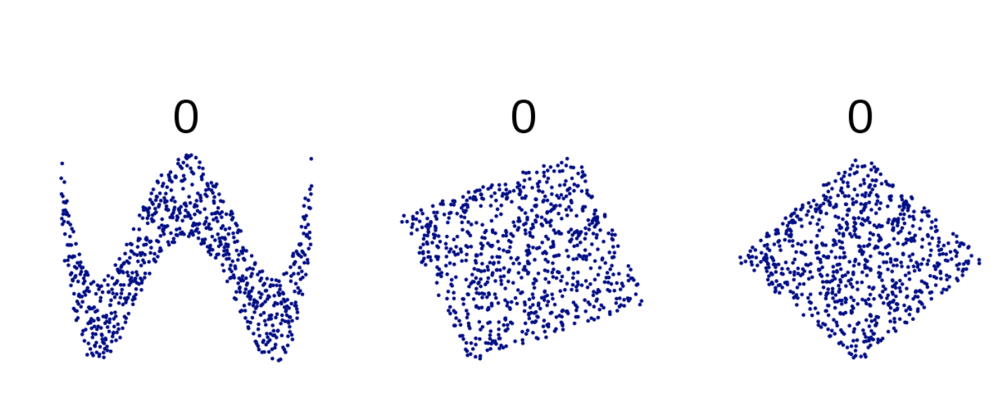
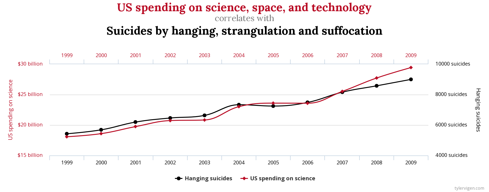

# Słowem przypomnienia

## Kontekst 


## Etapy


## Operacjonalizacja

Definiowanie zmiennej przez pryzmat obiektywnych, empirycznych wskaźników.

## Zmienne

Jakakolwiek własność lub cecha, która przyjmuje różne wartości u różnych ludzi, w różnych sytuacjach etc.

- *Zmienne niezależne* to te, którymi badacz manipuluje lub które kontroluje w swoim badaniu.
- *Zmienne zależne* to te, w przypadku których weryfikujemy **czy ich poziom zmienia się, jeżeli zmienia się poziom zmiennej niezależnej**. 

## Zmienne a przyczynowość

- Zmienna niezależna **wyjaśnia zmienność** zmiennej zależnej
- Czasem zmienna niezależna **wpływa na** zmienną zależną, ale nie zawsze

# Podstawowe rodzaje zależności statystycznych

## Podstawowe rodzaje zależności statystycznych

- Różnice pomiędzy grupami
- Korelacje

## Różnice pomiędzy grupami - przykładowe hipotezy

- Kobiety są bardziej rozmowne niż mężczyźni
- Ludzie rozmawiający przez telefon w czasie jazdy samochodem gorzej prowadzą samochód niż ludzie nie rozmawiający przez telefon
- Ludzie z kultury amerykańskiej są bardziej indywidualistyczni niż ludzie z kultury polskiej

## Jak porównujemy grupy

- Miary tendencji centralnej: średnia, mediana, moda
- Miary zmienności, rozproszenia wyników wokół średniej: odchylenie standardowe, wariancja

```{r include=FALSE}
library(readr)
library(tidyverse)
ppl_imperial <- read_csv("data/weight-height.csv")
ppl <- ppl_imperial %>% 
  transmute(Height = Height * 2.54, Weight = Weight * 0.45, Gender = Gender)
```

## Czy mężczyźni są wyżsi niż kobiety?

## Rozkład wzrostu w próbie

```{r echo=FALSE}
ppl %>% ggplot(aes(Height)) +
  geom_histogram(binwidth = 1)
```

## Rozkład wzrostu w zależności od płci

```{r echo=FALSE}
ppl %>% 
  ggplot(aes(Height, colour = Gender)) +
  geom_freqpoly(binwidth = 1)
```

## Czy mężczyźni są wyżsi niż kobiety?

```{r echo=FALSE}
ppl %>% 
  group_by(Gender) %>% 
  summarise(mean_height = mean(Height, na.rm = T)) %>% 
  ggplot(aes(Gender, mean_height)) + 
    geom_col()
```

## Czy mężczyźni są wyżsi niż kobiety?

```{r echo=FALSE}
ggplot(ppl, aes(Gender, Height)) +
  geom_boxplot()
```

## Wykres ramka-wąsy (Tukey)

- *Box-and-whiskers plot*
- W środku mediana
- Ramka od Q1 do Q3
- Wąsy od min do max **bez obserwacji odstających**

## Czy mężczyźni są ciężsi niż kobiety?

```{r echo=FALSE}
ggplot(ppl, aes(Gender, Weight)) +
  geom_boxplot()
```

## Korelacja

- Siła związku między zmiennymi
- Im silniejszy związek, tym dwie zmienne są bliżej zależności **liniowej**
- Związek najczęściej wyrażony współczynnikiem korelacji

## Współczynnik korelacji

- Technicznie kilka różnych, w praktyce podobna interpretacja
- r Pearsona, rho Spearmana, tau Kendalla
- Wartości od -1 do 1, im wyższa wartość bezwzględna, tym silniejszy związek
- Wsp. korelacji = 1 lub -1 - idealna zależność liniowa

## Korelacje dodatnie i ujemne

- Dodatni/pozytywny związek, r > 0: wyższe wartości A wiążą się z wyższymi B
- Ujemny/negatywny związek, r < 0: wyższe wartości A wiążą się z niższymi B

## Waga wiąże się ze wzrostem? (N=100)

```{r echo=FALSE}
ppl_100 <- ppl %>% 
  slice(sample(1:10000, size = 100, replace = T)) 

r_pears <- cor(ppl_100$Height, ppl_100$Weight)

ppl_100 %>% 
  ggplot(aes(Height, Weight)) +
    geom_point() +
    ggtitle(paste("Waga i wzrost, N = 100, r = ", r_pears %>% round(2) %>% toString()))
```

## Waga wiąże się ze wzrostem? (N=100)

```{r echo=FALSE, warning=FALSE}
ppl %>% 
  slice(sample(1:10000, size = 100, replace = T)) %>% 
  ggplot(aes(Height, Weight)) +
  geom_point(alpha = 6/10) + 
  geom_smooth()
```

## Waga a wzrost (N=10000)

```{r echo=FALSE, warning=FALSE}
ppl %>% ggplot(aes(Height, Weight)) +
  geom_point(alpha = 2/10)
```

## Waga a wzrost (N=10000)

```{r echo=FALSE, warning=FALSE}
ppl %>% ggplot(aes(Height, Weight)) +
  geom_point(alpha = 1/10) + 
  geom_smooth()
```

## Waga, wzrost a płeć?

```{r echo=FALSE, warning=FALSE}
ppl %>% ggplot(aes(Height, Weight, colour = Gender)) +
  geom_point(alpha = 1/10)
```

## Inne przykłady

---
```{r echo=FALSE, warning=FALSE}

r_pearsons <- function(x, y) {
  correlation <- cor(x, y) %>% 
    round(2) %>% 
    toString
  return(paste("r =", correlation))
}

ppl_rand <- ppl_100
ppl_rand$x1 <- sample(1:200, size = 100)
ppl_rand$x2 <- sample(1:15, size = 100, replace = T) * ppl_rand$Height
ppl_rand$x3 <- sample(1:15, size = 100, replace = T) - ppl_rand$Height
ppl_rand$x4 <- sample(1:50, size = 100, replace = T) - ppl_rand$Height

ppl_rand %>% ggplot(aes(Height, x1)) +
  geom_point() + 
  ggtitle(r_pearsons(ppl_rand$Height, ppl_rand$x1))
```

---

```{r echo=FALSE, warning=FALSE}

ppl_rand %>% ggplot(aes(Weight, x2)) + 
  geom_point()
```

---

```{r echo=FALSE, warning=FALSE}

ppl_rand %>% ggplot(aes(Weight, x2)) + 
  geom_point() + 
  ggtitle(r_pearsons(ppl_rand$Weight, ppl_rand$x2))
```

---

```{r echo=FALSE, warning=FALSE}
ppl_rand %>% ggplot(aes(Weight, x3)) + 
  geom_point()
```

---

```{r echo=FALSE, warning=FALSE}
ppl_rand %>% ggplot(aes(Weight, x3)) + 
  geom_point() + 
  ggtitle(r_pearsons(ppl_rand$Weight, ppl_rand$x3))
```

---

```{r echo=FALSE, warning=FALSE}
ppl_rand %>% ggplot(aes(Weight, x4)) + 
  geom_point()
```

---

```{r echo=FALSE, warning=FALSE}
ppl_rand %>% ggplot(aes(Weight, x4)) + 
  geom_point() + 
  ggtitle(r_pearsons(ppl_rand$Weight, ppl_rand$x4))
```

# Czy z tą korelacją to zawsze taka prosta sprawa?

## Zagadka (kwartet Anscombe'a)

---

```{r echo=FALSE, warning=FALSE}
anscombe %>% ggplot(aes(x1, y1)) + geom_point()
```

---

```{r echo=FALSE, warning=FALSE}
anscombe %>% ggplot(aes(x2, y2)) + geom_point()
```

---

```{r echo=FALSE, warning=FALSE}
anscombe %>% ggplot(aes(x3, y3)) + geom_point()
```

---

```{r echo=FALSE, warning=FALSE}
anscombe %>% ggplot(aes(x4, y4)) + geom_point()
```

## r = ?

## r = 0.816 dla WSZYSTKICH zbiorów

## Jak to jest możliwe?

- Współczynnik korelacji jest czuły na związki **liniowe**
- Zaburzenie liniowości powoduje "dziwne" efekty
- Czy można powiedzieć że we wszystkich 4 przypadkach związek jest taki sam?

## Inne dziwolągi (zaburzenie liniowości)



## Inne dziwolągi (zaburzenie liniowości)


# Korelacja, obserwowany związek a przyczynowość 

## Podstawowe pytanie

- Czy jeśli a koreluje z b to a **spowodowało** b?
- Być może tak...
- ...albo nie!!!!!!!!!!
- Tylko na podstawie faktu, że a koreluje z b nie możemy wyciągnąć wniosków przyczynowo-skutkowych

## Jakie są możliwości? (przykłady z wikipedia.org)

## A powoduje B

- Wiek koreluje ze wzrostem u dzieci
- Dziecko rośnie ponieważ się starzeje, a nie na odwrót

## B powoduje A

- Im szybciej kręcą się wiatraki, tym wiatr wieje szybciej...
- Więc wiatraki powodują wiatr
- ...
- ...mamy dobre argumenty, żeby sądzić, że jest dokładnie na odwrót

## B powoduje A

- Ludzie w średniowieczu wierzyli, że posiadanie wszy jest gwarancją życia w dobrym zdrowiu
- Obserwacja: bardzo rzadko można zaobserwować wszy na chorym człowieku
- ???
- Wszy okazują się być bardzo wrażliwe na temperaturę. Przy najmniejszym stanie podgorączkowym uciekają

---

- Spanie w butach jest silnie skorelowane z bólem głowy po przebudzeniu
- ?

## Trzeci czynnik C powoduje A i B

- Pijaństwo powoduje spanie w butach
- Pijaństwo powoduje ból głowy po przebudzeniu

## Trzeci czynnik C powoduje A i B

- Spożycie lodów jest silnie dodatnio skorelowane z liczbą zgonów w wyniku utonięcia
- ?
- Wzrost temperatury powoduje wzrost spożycia lodów. Wzrost temperatury powoduje, że więcej ludzi się kąpie i, w konsekwencji, więcej jest utonięć

## A powoduje B a B powoduje A (zależności cykliczne, sprzężenia zwrotne)

- Rowerzyści mają niższe BMI niż ludzie nie jeżdżący na rowerze
- Czy jazda na rowerze obniża BMI?
- Czy niskie BMI sprzyja jeżdżeniu na rowerze?

## Dodatnie i ujemne sprzężenia zwrotne (_feedback loops_)

- Dodatnie sprzężenie zwrotne:
    - wzrost A powoduje wzrost B
    - wzrost B powoduje wzrost A
    - wzrost A powoduje wzrost B
    - itd.
    - obie zmienne wzrastają

## Dodatnie i ujemne sprzężenia zwrotne (_feedback loops_)

- Ujemne sprzężenie zwrotne:
    - spadek A powoduje spadek B
    - spadek B powoduje spadek A
    - spadek A powoduje spadek B
    - itd.
    - obie zmienne maleją
    
## Sprzężenia zwrotne

- Depresja i ból
- Fear avoidance model of chronic pain
- Nieśmiałość i lęk

# Kilka przykładów tego, że korelacja i przyczynowość nie idą w parze 

---

- Wynik ostatniego domowego meczu Washington Redskins przed wyborami prezydenckimi w USA był wprost skorelowany z wynikiem wyborów (od 1936 do 2000)
- Od 200 lat przywódcy Rosji/Związku Radzieckiego są na zmianę łysiejący i "włochaci"

--- 


---



<small>Wykres pochodzi z [http://tylervigen.com/spurious-correlations](http://tylervigen.com/spurious-correlations)</small>

---


<small>Wykres pochodzi z [http://tylervigen.com/spurious-correlations](http://tylervigen.com/spurious-correlations)</small>

---


<small>Wykres pochodzi z [http://tylervigen.com/spurious-correlations](http://tylervigen.com/spurious-correlations)</small>

---


<small>Wykres pochodzi z [http://tylervigen.com/spurious-correlations](http://tylervigen.com/spurious-correlations)</small>
---


<small>Wykres pochodzi z [http://tylervigen.com/spurious-correlations](http://tylervigen.com/spurious-correlations)</small>

---


<small>Wykres pochodzi z [http://tylervigen.com/spurious-correlations](http://tylervigen.com/spurious-correlations)</small>

---


<small>Wykres pochodzi z [http://tylervigen.com/spurious-correlations](http://tylervigen.com/spurious-correlations)</small>

---

## DLACZEGO?

- Bo tak wyszło
- Nigdy nie mamy pewności, czy wykryta korelacja nie jest przypadkowa

# Podsumowanie

## Literatura

<small>