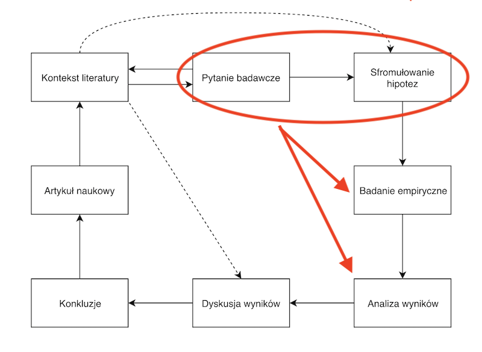

# Słowem przypomnienia

## Proces badawczy

## Proces badawczy

## Kosekwencje badania tylko niewielkiego wycinka populacji (próby)

- Jeżeli w interesującej nas populacji nie ma żadnej różnicy między dwoma grupami, możemy zaobserwować taką różnicę nawet w doskonale zaprojektowanym badaniu.
- Dzieje się tak ze dlatego, że nie badamy całej populacji, a jedynie jej niewielką część (próbę) i może wystąpić sytuacja, w której nawet gdy dana różnica w populacji nie występuje, do naszej próby trafią badani, którzy się różnią... bo tak wyszło.

--------

- *Wartość p* określa jak duże jest prawdopodobieństwo, że obserwowana przez nas różnica mogła pojawić się w sytuacji, w której w populacji nie ma różnic między grupami.

## Jeżeli otrzymaliśmy p = 0,05

Oznacza to, że gdyby interesująca nas *zależność* nie istniała w populacji, to prawdopoodbieństwo uzyskania w badaniu zależności tak samo silnej lub silniejszej wynosiłoby 0,05.

## Jeżeli otrzymaliśmy p = 0,01

Oznacza to, że gdyby interesująca nas *zależność* nie istniała w populacji, to prawdopoodbieństwo uzyskania w badaniu zależności tak samo silnej lub silniejszej wynosiłoby 0,01.

# Hipoteza zerowa

## Co to jest hipoteza zerowa

- *Hipoteza zerowa* zakłada zaprzeczenie testowanej przez nas teorii.
- *Hipoteza zerowa* często mówi o braku zależności między zmiennymi, braku różnic między grupami itp.
- W praktyce często zakłada, że wartość testowanej statystyki nie jest różna od 0.

## Hipoteza alternatywna

:::incremental

- *Hipoteza alternatywna* to po prostu hipoteza, którą przyjęliśmy w naszym badaniu.
- O czym zwykle mówią hipotezy przyjmowane w badaniach?
- O związku, zależności między zmiennymi.
- Przyjmujemy hipotezę alterantwną, gdy odrzucimy hipotezę zerową.
- Hipoteza zerowa to *zaprzeczenie* hipotezy alternatywnej i na odwrót: hipoteza alternatywna to zaprzeczenie hipotezy zerowej.

:::

## Jaki jest bardzo prosty wniosek z tego, że $H_0$ to zaprzeczenie $H_1$?

:::incremental

- Nie mogą być prawdziwe jednocześnie!!!

:::

## Po co przyjmujemy hipotezę zerową

- Badamy nie całą populację, a próbę.
- Musimy odnieść wyniki naszego badania do populacji.
- Nie wiemy, czy w całej populacji występują takie same zależności, jak w naszej próbie...

-----

- Możemy natomiast określić, z jakim prawdopodobieństwem moglibyśmy uzyskać taki wynik, jaki uzyskaliśmy, w warunkach, w których w rzeczywistości nie istniałaby interesująca nas zależność, a zatem w sytuacji, gdy hipoteza zerowa byłaby prawdziwa.

## Spróbujcie postawić hipotezy zerowe ($H_0$)

- $H_1$: w sytuacji eksperymentalnej kobiety i mężczyźni różnią się pod względem tego, jak często podejmują zachowania ryzykowne
- $H_1$: jeżeli wieczorem wypijemy kawę średni czas, jaki mija od położenia się do łóżka do zaśnięcia jest dłuższy, niż wtedy, gdy nie piliśmy kawy
- $H_1$: zasób słownika (liczba słów, które znamy) jest skorelowany z wiekiem  

## Oto one

- $H_0$: w sytuacji eksperymentalnej kobiety i mężczyźni nie różnią się pod względem tego, jak często podejmują zachowania ryzykowne
- $H_0$: nie ma różnicy w średnim czasie, jaki mija od położenia się do łóżka do zaśnięcia w sytuacji, gdy wieczorem wypiliśmy kawę albo gdy nie wypiliśmy kawy
- $H_0$: zasób słownika (liczba słów, które znamy) nie jest skorelowany z wiekiem

# Błąd I i II rodzaju

## Jakie błędy możemy popełnić testując $H_0$?

:::incremental

- Możemy odrzucić hipotezę zerową w sytuacji, gdy jest ona prawdziwa
- Możemy przyjąć hipotezę zerową w sytuacji, gdy jest ona fałszywa

:::

## Błąd I i II rodzaju

||$H_0$ jest fałszywa|$H_0$ jest prawdziwa|
|:-|:-:|:-:|
|Odrzucenie $H_0$|:)|Błąd I rodzaju|
|Przyjęcie $H_0$|Błąd II rodzaju|:)|

# Istotność statystyczna i błąd I rodzaju

## Co to znaczy, że wynik jest istotny statystycznie?

- Wynik istotny statystycznie to taki, którego pojawienie się w sytuacji gdy $H_0$ jest prawdziwa jest mało prawdopodobne.

## Co to znaczy "mało prawdopodobne"?

:::incremental

- Na to pytanie odpowiadamy określając *poziom istotności*

:::

## Poziom istotności

- Wynik istotny statystycznie to taki, dla kórego prawdopodobieństwo pojawienia się w sytuacji, gdy $H_0$ jest prawdziwa jest mniejsze od określonego wcześniej *poziomu istotności*.
- *Poziom istotności* oznaczamy zwykle grecką literą $\alpha$.

--------

- W psychologii zwykle $\alpha = 0.05$
- Jeżeli $p < \alpha$ mówimy, że wynik jest istotny statystycznie i odrzucamy $H_0$

## Istotność statystyczna a błąd I rodzaju

- Poziom istotności statystycznej to prawdopodobieństwo odrzucenia hipotezy zerowej W SYTUACJI, GDY JEST ONA PRAWDZIWA...
- ...a zatem prawdopodobieństwo popełnienia błędu I rodzaju.

## Dlaczego wymagany poziom istotności statystycznej powinniśmy określić ZANIM rozpoczniemy badania?

## Mamy wynik istotny statystycznie - co to dla nas oznacza?

:::incremental

- Jest mało prawdopodobne (na poziomie < $\alpha$), by pojawił się w sytuacji, gdy w populacji nie ma zależności pomiędzy interesującymi nas zmiennymi.
- Skoro jest to mało prawdopodobne, odrzucamy $H_0$ i przyjmujemy $H_1$

:::

## Mamy wynik istotny statystycznie - jakie pozostają niewiadome

- Czy wynik ma zanczenie praktyczne (zagadnienie wielkości efektu)
- Czy wynik, który uzyskaliśmy, jest rzeczywiście miarą tego, co chcieliśmy zmierzyć i możemy interpretować go tak, jak zakładaliśmy (zagadnienie trafności)
- Czy wynik zostanie zreplikowany

## Mamy wynik istotny statystycznie - czego to NIE oznacza?

- Że hipoteza zerowa jest fałszywa

-----

- 
Prawdopodobieństwo odrzucenia hipotezy zerowej, gdy jest prawdziwa to NIE to samo, co prawdopodobieństwo, że hipoteza zerowa jest prawdziwa.
 
- 
Wartość p NIE określa prawdopodobieństwa tego, że hipoteza zerowa jest prawdziwa.

----------

- 
Prawdopodobieństwo odrzucenia hipotezy zerowej, gdy jest prawdziwa to NIE to samo, co prawdopodobieństwo, że wynik pojawił się przez przypadek.

- 
Wartość p NIE określa prawdopodobieństwa tego, że wynik pojawił się przez przypadek.

## Jak to, tak dużo niewiadomych? Co teraz?!

- REPLILKACJA, REPLIKACJA, REPLIKACJA...
- ...i metaanaliza
- Analiza wielkości efektu i mocy testu
- Wykresy, analiza rozkładu zmiennych
- Przedziały ufności

# Moc testu i błąd II rodzaju

## Co to jest moc testu?

- Prawdopodobieństwo uzyskania statystycznie istotnego wyniku, gdy hipoteza aletrnatywna jest prawdziwa.
- Innymi słowy prawdopodobieństwo odrzucenia $H_0$, gdy $H_1$ jest prawdziwa.

## Kiedy moc testu jest większa?

- Im większy jest badany efekt (np. większa różnica między grupami, większa korelacja)
- Im więcej osób badamy

## Jak moc testu ma się do błędu II rodzaju?

- Im większa moc testu, tym *większe* prawdopodobieństwo *odrzucenia* $H_0$, gdy $H_1$ jest *prawdziwa*.  
- Tym samym, im większa moc testu, tym *mniejsze* prawdopodobieństwo popełnienia błędu II rodzaju.

## Notacja matematyczna

moc testu $= 1 - \beta$

$\beta$ - prawdopodobieństwo popełnienia błędu II rodzaju

## Kiedy określamy moc testu?

- Jak zwykle najlepiej *przed przeprowadzeniem badania* :)
  - Na podstawie literatury i/lub badania pilotażowego staramy się określić wielkość efektu, tzn. np. to jak duża może być różnica między grupami, jak silna korelacja.
  - Określamy, jaka moc testu będzie dla nas satysfakcjonująca, często przyjmowana wartość to 0,8.
  - Na tej podstawie szacujemy, ile osób musimy zbadać.

-----

- Możemy ją określić również *po przeprowadzeniu badania*, by poznać prawdopodobieństwo tego, że popełnieniliśmy błąd II rodzaju, tzn. nie odrzuciliśmy hipotezy zerowej, gdy była ona fałszywa. 
- Ma to szczególne znaczenie, gdy uzyskamy nieistotny wynik i chcemy się dowiedzieć, czy w naszym badaniu w ogóle byliśmy w stanie wykryć efekt danej wielkości.

# Co to ma wspólnego z liczebnością próby?

## Istotność statystyczna i moc testu a wielkość próby

- Im większa liczebność próby, tym większa moc testu i tym mniejsze wartości p jakie uzyskamy dla określonego wyniku.

--------

- Im większa liczebność próby, tym mniejsze prawdopodobieństwo, że nasze badanie "nie da rady" wykryć jakiejś zależności, która ma miejsce w populacji...
- ...ale jednocześnie tym większe prawdopodobieństwo, że gdy tak naprawdę nie ma w populacji interesującej nas zależności, a uzyskamy bardzo niewielką różnicę, to uznamy ją za istotną statystycznie i odrzucimy $H_0$, gdy nie powinniśmy tego zrobić.

## Co warto robić?

1. Przed rozpoczęciem badania określić, jak duży efekt będzie dla nas interesujący poznawczo lub jakiego się spodziewamy w oparciu o literaturę/pilotaż.
2. Ustalić, jaka  moc testu będzie dla nas satysfakcjonująca.
3. Na tej podstawie określić wielkość próby.
4. Interpretować uzyskane wyniki w kontekście tych ustaleń.

## Alternatywnie...

- Warto pamiętać o tych ograniczeniach i:
  + replikować
  + analizować uzyskaną wielkość efektu
  + analizować rozkłady zmiennych i przedziały ufności
  + tworzyć/czytać metaanalizy

# Podsumowanie

## Podsumowanie

- By określić, czy uzyskany na naszej próbie wynik można odnieść do populacji, testujemy hipotezę zerową.
- Hipoteza zerowa stanowi zaprzeczenie hipotezy, którą przjęliśmy w naszym badaniu, tak zwanej hipotezy alternatywnej.

---------

- Testując hipotezę zerową możemy popełnić błąd I i II rodzaju.
- Błąd I rodzaju polega na odrzuceniu hipotezy zerowej, gdy jest ona prawdziwa.
- Błąd II rodzaju polega na przyjęciu hipotezy zerowej, gdy jest ona fałszywa.

---------

- Testując hipotezę zerową określamy, z jak dużym prawdopodobieństwem mógłby pojawić się nasz wynik, gdyby była ona prawdziwa.
- Maksymalny dopuszczalny poziom takiego prawdopodobieństwa określamy mianem poziomu statystycznej istotności. 

----------

- To, jak duże jest prawdopodobieństwo, że odrzucimy hipotezę zerową, gdy prawdziwa jest hipoteza alternatywna określa się mianem mocy testu.
- Zarówno zagadnienie statystycznej istotności, jak i mocy testu jest związane z liczebnością próby.
- Powinniśmy być świadomi ograniczeń podejścia polegającego na testowaniu hipotez zerowych.
- Świadomi tych ograniczeń, powinniśmy kłaść duży nacisk na REPLIKACJĘ

