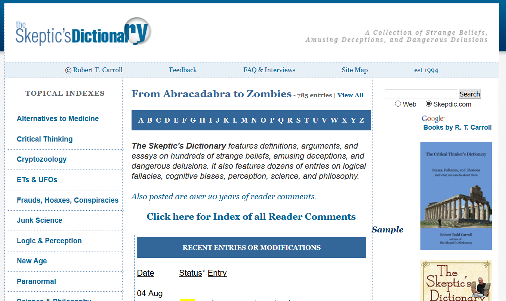

# Psychologia jest nauką empiryczną

## Dwa pytania

- czy nie wystarczy po prostu powiedzieć, że psychologia jest nauką?
- czy by uznać jakąś dziedzinę za naukę wystarczy, by posługiwała się empirią?

## Empiria - usystematyzowana i nieusystematyzowana

**Empiria - doświadczenie, poznanie za pośrednictwem zmysłów** (SJP)  

**Czy nasze doświadczenie (za pośrednictwem zmysłów) zawsze dostarcza nam precyzyjnego opisu rzeczywistości?**

## Źródła terminu i minimum historii

- Termin *psychologia* oznacza po grecku dosłownie "naukę o duszy"
- Tak rozumiana psychologia była obiektem zainteresowania wielu **filozofów**
- Pierwsze laboratorium psychologiczne - Wilhelm Wundt, Lipsk, 1879 r.
- Niektórzy uważają za początek empirycznego podejścia do badania procesów psychicznych badania Gustava Fechnera w dziedzinie psychofizyki (prawo Fechnera-Webera, ca. 1830 r.). 

## W psychologii stosujemy metodę naukową

- Psycholog polega na badaniach empirycznych w wyciąganiu wniosków nt. zachowania ludzi
- Badania empiryczne oparte są na danych zbieranych i analizowanych w systematyczny sposób
- Na pytania stawiane w psychologii da się odpowiedzieć z wykorzystaniem badań 

## Nauka a praca kliniczna

- Zaburzenia psychiczne są częścią świata empirycznego, dlatego *można* je badać empirycznie
- Skuteczność terapii psychologicznych również można badać empirycznie (w paradygmacie badań klinicznych)

# Nauka i metoda naukowa

## Co to jest nauka?

:::incremental

- jednen z rodzajów wiedzy ludzkiej - jaki?
- "usystematyzowane przedsięwzięcie tworzenia i organizowania wiedzy w formie testowalnych wyjaśnień i przewidywań dotyczących świata" (tłumaczenie za: [Wikipedia(en)/Science, dostęp: 18.10.2021](https://en.wikipedia.org/wiki/Science#cite_note-EOWilson1999a-2))
- czyli innymi słowy przedsięwzięcie tworzenia i organizowania wiedzy z wykorzystaniem *metody naukowej*

:::

## Jakie są źródła wiedzy (nie koniecznie naukowej)?

- intuicja
- autorytet
- rozumowanie (sylogistyczne, od założeń do wniosków) $\to$ *wykład o teoriach*
- empiria $\to$ *wykład o teoriach*
- *metoda naukowa*

<small>Na podstawie: [Research Methods in Psychology](https://kpu.pressbooks.pub/psychmethods4e/) by Rajiv S. Jhangiani, I-Chant A. Chiang, Carrie Cuttler, & Dana C. Leighton, licensed under a [Creative Commons Attribution-NonCommercial-ShareAlike 4.0 International License](https://creativecommons.org/licenses/by-nc-sa/4.0/)</small>

## Przykład weryfikacji zdroworozsądkowego twierdzenia

:::incremental

- Czy uważacie, że kobiety mówią więcej, niż mężczyźni?
- Badania Mehla i wsp. (2007):
    + 396 uczestników
    + samplowanie odgłosów z otoczenia przez kilka dni
    + kobiety wypowiadały średnio 16 215 słów (SD = 7 301)
    + mężczyźni wypowiadali średnio 15,669 słów (SD = 8 633)
    + różnica nie była istotna statystycznie

:::

## Kryzys replikacji

- niektórzy zwracają uwagę na kryzys replikacji w psychologii (i innych naukach)
- kryzys ten polega na tym, że raz uzyskane wyniki nie dają się powtórzyć w kolejnych badaniach
- możemy poradzić sobie z tym kryzysem dzięki:
    + znajomości ograniczeń, jakie pojawiają się w badaniach empirycznych
    + stawianiu nowych, testowalnych hipotez dotyczących badanych zjawisk
    + tolerancji niewiedzy

## Cechy metody naukowej

- usystematyzowany empiryzm (usystematyzowane obserwacje)
- pytania o charakterze empirycznym (czyli takie, na które da się odpowiedzieć dokonując obserwacji)
- wiedza w domenie publicznej

<small>Na podstawie: [Research Methods in Psychology](https://kpu.pressbooks.pub/psychmethods4e/) by Rajiv S. Jhangiani, I-Chant A. Chiang, Carrie Cuttler, & Dana C. Leighton, licensed under a [Creative Commons Attribution-NonCommercial-ShareAlike 4.0 International License](https://creativecommons.org/licenses/by-nc-sa/4.0/)</small>

# Nauka i pseudonauka

## Co robią naukowcy?

:::incremental

- Tworzą teorie
- Stawiają hipotezy
- Prowadzą badania, tzn. gromadzą dane pochodzące z eksperymentów i obserwacji
- Komunikują wyniki swoich badań
- Poznają wyniki badań innych naukowców i dyskutują z nimi (*peer-review*)

:::

## Co stanie się...

...jeżeli ktoś będzie tworzył teorie, stawiał hipotezy, prowadził badania nierzetelnie, bez naukowej integralności i nie stosując metody naukowej?

## Co to jest pseudonauka

- Niektórzy ludzie propagują treści i teorie, które na pierwszy rzut oka *wydają się* być naukowe, ale takie nie są
- Nie są, bo np. nie są falsyfikowalne, osoby je propagujące nie są bezstronne, dane zostały zebrane w sposób niesystematyczny (lub wcale nie zostały zebrane), teorie zawierają błędy logiczne
- Innymi słowy, przypominają naukę, ale powstały bez zastosowania metody naukowej

--------

- Jest wiele pseudonaukowych teorii ocierających się o psychologię:
    - ESP (postrzeganie pozazmysłowe)
    - Biorytmy
    - Astrologia
    - Numerologia
    - Terapie pseudonaukowe

## Problem demarkacji

- na podstawie jakich kryteriów możemy odróżnić naukę od pseudonauki? 
    + falsyfikowalność
    + normy mertońskie
    + formalne aspekty teorii 
    + naukowy status badanych zjawisk

# Dziwaczne terapie psychologiczne
    
## Długa lista dziwacznych terapii psychologicznych (za Singer i Lalich, *Crazy Therapies*, 1996)

- Leonard Orr opracował teorię oddychania energią. Według niego, jeśli nauczysz się oddychać właściwie, możesz *wydechnąć* (breathe away) choroby i ból.
- Marguerite Sechehaye i John Rosen praktykują terapię regresji i "reparentingu". Terapeuta staje się zastępczym rodzicem pacjenta, aby naprawić szkody które wyrządzili jego prawdziwi rodzice.

----

- Jacqui Shiff uważa, że pacjent musi chodzić w pieluchach, ssać kciuka i pić z butelki aby wyzdrowieć.
- Sondra Ray i Bob Mandel uważają, że twoje problemy wynikają ze sposobu, w jaki się urodziłeś. Pomogą ci "urodzić się na nowo", tym razem właściwie.

---

- John Fuller, Bruce Goldberg, Brian Weiss, Edith Fiore, Richard Boylan, David Jacobs, Budd Hopkins i  John Mack używają hipnozy, aby odkryć dawne (lub przyszłe!) przypadki w życiu pacjenta, w których został porwany przez kosmitów. Ma to pomóc...
- John Bradshaw uważa, że każdy ma swoje *wewnętrzne dziecko*, dla którego musi być dobry aby pozostać w zdrowiu psychicznym

## www.skepdic.com

## Z naszego podwórka - Bałtycki Instytut Psychologii

# Bibliografia

## Bibliografia

<small>

1. Edlund, J. E., & Nichols, A. L. (Eds.). (2019). Advanced Research Methods for the Social and Behavioral Sciences (1st ed.). Cambridge University Press. https://doi.org/10.1017/9781108349383
2. Jhangiani, R., Chiang, I.-C. A., Cuttler, Carrie, Leighton, D. C., & Kwantlen Polytechnic University. (2019). Research methods in psychology. https://kpu.pressbooks.pub/psychmethods4e/
3. Mehl, M. R., Vazire, S., Ramírez-Esparza, N., Slatcher, R. B., & Pennebaker, J. W. (2007). Are Women Really More Talkative Than Men? Science, 317(5834), 82–82. https://doi.org/10.1126/science.1139940
4. Shaughnessy, J. J., Zechmeister, J. S., Zechmeister, E. B., & Rucińska, M. (2002). Metody badawcze w psychologii. Gdańskie Wydawnictwo Psychologiczne.
5. https://en.wikipedia.org/wiki/Science, dostęp: 2021-10-19

