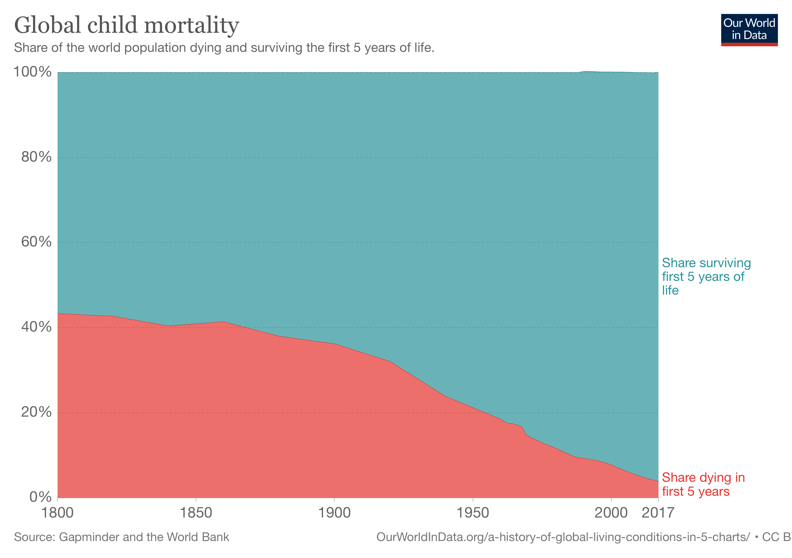

# Słowem przypomnienia

## Metoda naukowa

Zestaw założeń, zasad i procedur, których naukowcy używają, żeby prowadzić badania empiryczne [@stangor2014].

## Normy mertońskie

- Stanowią etos nauki, powinny mieć swoje przejawy w działaniu instytucji nauki i obejmują:
  - wspólność (ang. *communality, communalism*)
  - uniwersalizm (ang. *universalism, universality*)
  - bezinteresowność (ang. *disinterestedness*)
  - zorganizowany sceptycyzm (ang. *organised skepticism*)

## Lista kwestionowalnych praktyk badawczych (QRP) w badaniu integralności

- Niewystarczająca uwaga poświęcona sprzętowi, umiejętnościom lub doświadczeniu
- Niedostatecznie nadzorowani albo otoczeni opieką (mentorowani???!!!) młodsi współpracownicy
- Nieadekwatne plany badawcze lub nieodpowiednie narzędzia pomiarowe

<small>Gopalakrishna, G., Riet, G. ter, Vink, G., Stoop, I., Wicherts, J., & Bouter, L. (2021). Prevalence of questionable research practices, research misconduct and their potential explanatory factors: A survey among academic researchers in The Netherlands. MetaArXiv. https://doi.org/10.31222/osf.io/vk9yt </small>

---------

- Nieuczciwa ocena manuskryptów, wniosków grantowych lub współpracowników
- Niedostatecznie uzasadnione wnioski
- Niewłaściwe odwołania do źródeł
- Nieadekwatne notatki dotyczące procesu badawczego

<small>Gopalakrishna, G., Riet, G. ter, Vink, G., Stoop, I., Wicherts, J., & Bouter, L. (2021). Prevalence of questionable research practices, research misconduct and their potential explanatory factors: A survey among academic researchers in The Netherlands. MetaArXiv. https://doi.org/10.31222/osf.io/vk9yt </small>

-------

- Brak raportowania istotnych szczegółów na temat badania w publikacji
- Nieskładanie albo nieskładanie ponownie do publikacji badań o negatywnych wynikach
- Niedostateczne raportowanie wad i ograniczeń badania w publikacji
- Selektywne cytowanie źródeł, by wzmocnić wyniki lub przekonania

<small>Gopalakrishna, G., Riet, G. ter, Vink, G., Stoop, I., Wicherts, J., & Bouter, L. (2021). Prevalence of questionable research practices, research misconduct and their potential explanatory factors: A survey among academic researchers in The Netherlands. MetaArXiv. https://doi.org/10.31222/osf.io/vk9yt </small>

## Statystycznie istotne czynniki wyjaśniające występowanie QRP

- normy dotyczące uprawiania nauki (-)
- normy dotyczące relacji z innymi badaczami (-)
- sprawiedliwość organizacji (-)
- presja publikacyjna
- presja w pracy
- mentoring
- tendencja do rywalizacji

<small>(-) oznacza negatywny związek. Gopalakrishna, G., Riet, G. ter, Vink, G., Stoop, I., Wicherts, J., & Bouter, L. (2021). Prevalence of questionable research practices, research misconduct and their potential explanatory factors: A survey among academic researchers in The Netherlands. MetaArXiv. https://doi.org/10.31222/osf.io/vk9yt </small>

## Cytat

*Science is a struggle for truth against methodological, psychological, and sociological obstacles.* [@Fanelli2013]

## Metoda naukowa...

- ...jest najskuteczniejszym znanym ludzkości sposobem poznawania świata
  + wiemy, że nie zawsze myślimy racjonalnie nawet w sytuacjach, które tego by wymagały i w których jesteśmy przekonani, że tak właśnie jest [@kahneman]
  + udało się wyeliminować "dziki" wariant polio [@polio]
  + rozumiemy, dlaczego klimat się ociepla i możemy temu przeciwdziałać 
  + wiemy, że koronawirus roznosi się drogą kropelkową

## Śmiertelność dzieci

# Teorie naukowe

## Cele nauki

- opisywanie rzeczywistości
- przewidywanie
- wyjaśnianie

## Trzy rodzaje modeli (teorii) w nauce

- modele "co?"
- modele "jak?"
- modele "dlaczego?"

## Co to jest teoria naukowa

- Teoria naukowa – zestaw reguł, które wyjaśniają i pozwalają przewidywać wiele (lecz nie wszystkie) zjawiska w jakiejś dziedzinie
- W psychologii np.:
    - Teoria społecznego uczenia się
    - Teoria rozwoju poznawczego Piageta
    - Teoria przeniesienia pobudzenia emocjonalnego
    - Teoria salutogenetyczna Antonovskiego
    - …i SETKI innych mniejszych/większych teorii

## Teoria naukowa w psychologii

- Definicja teorii naukowej wg Shaughnessy'ego i in.[-@shaughnessy]

>Teoria to proponowane wyjaśnienie  
>przyczyn zachowań, na które składają się  
>logicznie zorganizowane twierdzenia definiujące  
>zdarzenia, opisujące zachodzące między nimi związki
>i wyjaśniające występowanie tych zdarzeń.

## Różne poziomy wyjaśniania ludzkiego zachowania [@stangor2014]

- Biologiczny
- Interpersonalny
- Kulturowy i społeczny

## Warunki dobrej teorii naukowej (za Stangorem ale nie tylko)

Dobra teoria naukowa powinna:

1. Być ogólna
2. Być oszczędna
3. Stymulować dalsze badania
4. Być falsyfikowalna

## Brzytwa Ockhama

- **Spośród konkurencyjnych hipotez, wybrana powinna być ta z najmniejszą ilością założeń**
- Przykład: w czasach Kopernika obserwacje ciał niebieskich można było wytłumaczyć zarówno modelem helio-, jak i geocentrycznym. Model geocentryczny wymagał jednak bardzo wielu założeń a heliocentryczny tylko siedmiu
- Często brzytwa jest nadinterpretowana – *„najprostsze wyjaśnienie jest najlepsze”* (!)
- A.Einstein: *„wszystko powinno być opisane tak prosto jak to tylko możliwe… ale nie prościej!”*

# Rozumowanie w nauce

## Różne rodzaje rozumowań

- Dedukcyjne – wnioskowanie o konkluzjach na podstawie logicznych przesłanek
  - Prawo sylogizmu - jeśli A->B i  B->C to A->C
  - np.: Wszyscy ludzie są śmiertelni. Elvis Presley jest człowiekiem. Elvis Presley jest śmiertelny.
- Indukcyjne
- Abdukcyjne – obserwujemy zjawisko i poszukujemy jego wyjaśnienia (rozumowanie post hoc)

## Nauka z perspektywy kurczaków czyli problem indukcji

- Kurczak co rano obserwuje jak hodowca przychodzi i wydaje jedzenie
- Na mocy indukcji kurczak stwierdza, iż prawdziwe jest zdanie „hodowca każdego dnia przychodzi wydać jedzenie”
- Problem – pewnego dnia hodowca przychodzi i ukręca łeb kurczakowi

## Nauka z perspektywy kurczaków czyli problem indukcji

- Inne przykłady:
    - Każdego dnia wschodzi słońce
    - Jeśli ktoś umiera, to nigdy nie jestem to ja.
- Czy można orzec o prawdziwości teorii na podstawie danych empirycznych, które ją potwierdzają?

## Problem indukcji

- Problem filozoficzny (D.Hume) – nie ma logicznego uzasadnienia dla przewidywania przyszłości tylko na podstawie wydarzeń z przeszłości
- Nie spostrzegamy zależności przyczynowo-skutkowych, a jedynie następstwo pewnych zdarzeń, czyli widzimy, że A następuje przed B, ale nie możemy jedynie na tej podstawie wnosić, że A powoduje B

------------

- Nie czyniąc dodatkowych założeń, nie mamy również podstaw, by twierdzić, że jeżeli A w przeszłości współwystępowało z B, to w przyszłości również tak będzie

## Jeden ze sposobów na poradzenie sobie z problemem indukcji

- To co otrzymujemy na drodze indukcji to nie dowód na prawdziwość teorii tylko jej uprawdopodobnienie
- Teorie naukowe można zatem traktować probabilistycznie, jako określające najbardziej prawdopodobne, w świetle posiadanej wiedzy, relacje między zjawiskami
    
## Rozumowania abdukcyjne

Definicja za [Stanford Encyclopedia of Philosophy](https://plato.stanford.edu/entries/abduction/)

>"Wnioskowanie dla najlepszego wyjaśnienia". Forma rozumowania wyjaśniającego, wykorzystywanego do (I) generowania lub (II) uzasadniania hipotez.

## Rozumowania abdukcyjne

- Codziennie rozumujemy abdukcyjnie :) plemiona zbieraczy i antylopy, szereg przykładów z życia codziennego
- Np. w trakcie gry w bilard obserwujemy poruszającą się czarną bilę 
  -   Możemy założyć, że porusza się ona, ponieważ została uderzona przez białą bilę. Nie jest to zawsze prawdziwe założenie, ale pozwala nam orientować się w danym zjawisku

------- 

- Naukowcy formułują prawdopodobne hipotezy na temat świata, czyli możliwe wyjaśnienia obserwowanych zjawisk 
- Hipotez może być wiele – problem wyboru dobrej hipotezy: brzytwa Ockhama, falsyfikowalność

# Podsumowanie

## W skrócie

- Teorie naukowe w psychologii pozwalają (lub powinny pozwalać) na opisanie, przewidywanie i wyjaśnienie (ludzkiego) zachowania.
- Teorie w psychologii mogą wyjaśniać zachowania na różnym poziomie.
- Teorie powinny być oszczędne, możliwie ogólne, stymulujące dalsze badania i falsyfikowalne.

----------

- Rozumowanie indukcyjne może nam pozwolić na uprawdopodobnienie naszych teorii, ale ma swoje ograniczenia, ponieważ nie mamy podstaw, by twierdzić, że współwystępujące zjawiska są przyczynowo związane lub będą nadal współwystępować w przyszłości.

## Literatura

<small>

