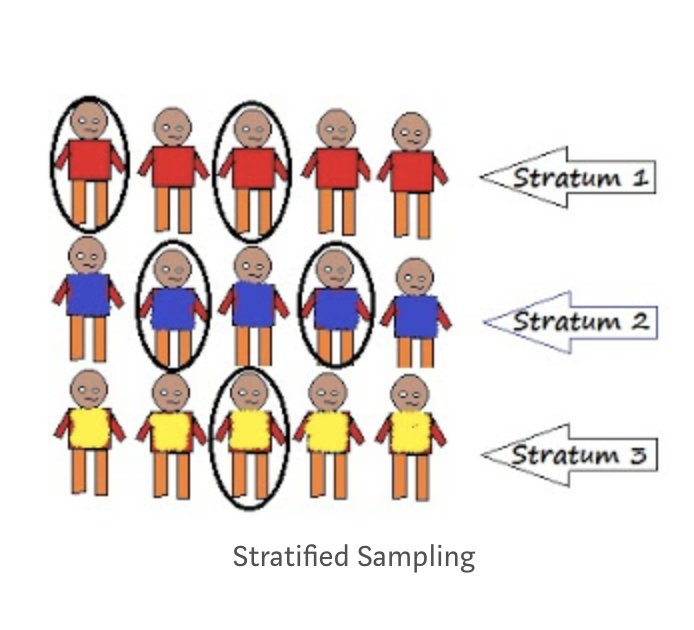

# Słowem przypomnienia

## Rodzaje związków między zmiennymi

- Różnice między grupami:
  + zmienna niezależna: zmienna grupująca
  + zmienna zależna: zmienna, której zmienność może być wyjaśniania przynależnością do grup różniących się poziomiem zmiennej niezależnej
- Korelacja:
  + określamy współzmienność zmiennej niezależnej i zależnej, związek liniowy między nimi

## Przykłady

::: incremental

- długość życia a przynależność do grup o niskim i wysokim statusie socjoekonomicznym (w wybranym okresie, np. w dzieciństwie)
- spodziewana długość życia a dochody (na podstawie analiz demograficznych)
- płeć a zdolności matematyczne (uwaga: mamy poważne powody, by twierdzić, że nie ma różnicy między dziewczynkami a chłopcami)

:::

----

::: incremental

- jedzenie cukierków w dzieciństwie i ryzyko bycia aresztowanym za brutalne przestępstwo w dorosłości
- prymowanie przy pomocy zdjęcia twarzy osoby białej/czarnoskórej a szybkość identyfikacji bodźców związanych z przestępstwami

:::

## Współczynnik korelacji

- Technicznie kilka różnych, w praktyce podobna interpretacja
- Wartości od -1 do 1, im wyższa wartość bezwzględna, tym silniejszy związek
- Wsp. korelacji = 1 lub -1 - idealna zależność liniowa
- Im silniejszy związek, tym dwie zmienne są bliżej zależności **liniowej**

## Korelacje dodatnie i ujemne - symulacja

[https://rpsychologist.com/correlation/](https://rpsychologist.com/correlation/)

## Możliwe wyjaśnienia obserwowanego związku A z B

- A powoduje B lub B powoduje A
- A lub B powoduje całą->kaskadę->różnych->zmian, na końcu której jest druga badana zmienna
- Trzeci czynnik (grupa czynników) powoduje, że pojawia się związek A i B
- Dodatnie i ujemne sprzężenia zwrotne (zależności cykliczne)
- Związek może być PRZYPADKOWY

## Czekolada i nagroda Nobla

- Wyniki badania opublikowanego w NEJM [link](https://www.nejm.org/doi/full/10.1056/NEJMon1211064) wskazują, że między konsumpcją czekolady (kg/rok/mieszkaniec) a liczbą nagród Nobla jakie zdobyli obywatele danego państwa istnieje silna, dodatnia, istotna statystycznie korelacja (r = 0,791; p < 0,0001)

## Korelacja to to co widzimy :) przyczynowość = interpretacja

- Należy pamiętać, że kiedy interpretujemy jakąś obaserwację przyczynowo zakładamy, że manipulacja zmienną niezależną spowoduje określone zmiany zmiennej zależnej 

## Kiedy możemy mówić o związku przyczynowym?

- Kiedy zrobimy (dobry) eksperyment

## Z zachowaniem ***DUŻEJ*** ostrożności również, gdy:

- zaobserwujemy związek między zmiennymi (na marginesie: istnieją matematyczne narzędzia, które pozwalają na uprawdopodobnienie założenia o przyczynowości)
- ustalimy następstwo czasowe (przyczyna musi poprzedzać skutek)
- będziemy skutecznie kontrolować zmienne zakłócające (uwaga: nigdy nie możemy być pewni, że kontrolujemy wszystkie!)
- wykluczymy alternatywne wyjaśnienia
    
## Paradoks Simpsona na przykładzie leczenia kamieni nerkowych

||Leczenie A|Leczenie B|
|:--|:-:|:-:|
| | | |
| | | |
|Ogółem|78% (273/350)|**83% (289/350)**|

## Paradoks Simpsona na przykładzie leczenia kamieni nerkowych

||Leczenie A|Leczenie B|
|:--|:-:|:-:|
|Małe kamienie|**93% (81/87)**|87% (234/270)|
|Duże kamienie|**73% (192/263)**|69% (55/80)|
|Ogółem|78% (273/350)|**83% (289/350)**|

<small>Charig, C. R., Webb, D. R., Payne, S. R., & Wickham, J. E. (1986). Comparison of treatment of renal calculi by open surgery, percutaneous nephrolithotomy, and extracorporeal shockwave lithotripsy. BMJ, 292(6524), 879–882. https://doi.org/10.1136/bmj.292.6524.879</small>

# Terminologia i uwagi wstępne

## Gdy w naszym badaniu (eksperymencie) mamy więcej niż jeden warunek

- Dobór do warunków eksperymentalnych musi być losowy - randomizacja
- Wykluczamy w ten sposób, że osoby w jednym warunku różnią się w jakiś szczególny sposób od osób w innym warunku
- Jest to sposób kontrolowania zmiennych związanych z charakterystyką osób badanych
- RANDOMIZACJA TO NIE TO SAMO, CO DOBÓR PRÓBY!!!!

## Populacja i próba

- *Populacja* - ogół osób, do których odnosi się dana teoria psychologiczna (np. populacja wszystkich ludzi, populacja kobiet, populacja niemowląt)
- Najczęściej nie możemy zbadać całej populacji ze względów praktycznych
- Badamy tylko określoną cześć populacji - *próbę*
- Jest wiele różnych metod *doboru próby*

# Metody doboru próby

## Metody probabilistyczne

- Zakłada, że dysponujemy jakimś *operatem losowania* dla badanej populacji i z niego **losowo** wyłaniamy osoby badane
  + Dobór prosty losowy (_simple random sampling_)
  + Dobór warstwowy (_stratified sampling_)
  + Dobór systematyczny (_systematic sampling_)
  
## Metody nieprobabilistyczne

- Dobór przypadkowy (_convenience sampling_)
- Dobór kwotowy (_quota sampling_)
- Kula śniegowa (_snowball sampling_)

## Dobór prosty, losowy

- Każda osoba z populacji ma równą szansę dostania się do próby
- Potrzebny **operat losowania**

## Dobór prosty, losowy

<small>Obrazek pochodzi z artykułu Seemy Singh pt. [Sampling Techniques](https://towardsdatascience.com/sampling-techniques-a4e34111d808)</small>

## Dobór warstwowy

- Dobór pod względem jakiejś ważnej charakterystyki
- Najpierw trzeba wyłonić ważne charakterystyki, co bywa trudne
- W obrębie warstw stosujemy dobór prosty losowy

## Dobór warstwowy

<small>Obrazek pochodzi z artykułu Seemy Singh pt. [Sampling Techniques](https://towardsdatascience.com/sampling-techniques-a4e34111d808)</small>

## Dobór systematyczny

- Jeśli dysponujemy populacją uszeregowaną, możemy wybrać co n-tą osobę z szeregu
- Często w badaniach medycznych (np. _co trzecia osoba rejestrująca się do onkologa w WCO_)
- Metoda dobra jeśli tylko lista nie zawiera w sobie ukrytego porządku

## Dobór systematyczny

<small>Obrazek pochodzi z artykułu Seemy Singh pt. [Sampling Techniques](https://towardsdatascience.com/sampling-techniques-a4e34111d808)</small>

## Dobór przypadkowy

- Kto się nawinie
- Najczęstszy przypadek w badaniach psychologicznych
- Może nie stanowić problemu, może stanowić ogromny problem

## Dobór kwotowy

- Zakładamy liczebności osób o zadanych cechach obecne w populacji
- Rekrutujemy badanych aż osiągniemy te liczebności

## Kula śniegowa

- Rekrutujemy badanego, po czym każemy mu przyprowadzić ludzi podobnych do niego
- Zupełnie niepoprawne metodologicznie, ale czasem jest to jedyna opcja, jeśli badamy bardzo specyficzne populacje/bardzo rzadkie cechy

## Kula śniegowa

<small>Obrazek pochodzi z artykułu Seemy Singh pt. [Sampling Techniques](https://towardsdatascience.com/sampling-techniques-a4e34111d808)</small>

------

ISTNIEJE JESZCZE WIELE INNYCH METOD DOBORU PRÓBY

## Skąd wiemy, że zależność wykryta w próbie jest obecna w populacji?

- Nawet jeśli mamy najlepszy, najbardziej reprezentatywny dobór próby...
- ...nie wiemy (nie możemy być pewni).
- Możemy przypuszczać z określonym *prawdopodobieństwem*, że obserwowana przez nas zależność mogłaby wystąpić, gdyby zależność nie istniała i zależy nam na tym, by pokazać, że to prawdopodobieństwo jest znikomo małe.
- Do określenia tego prawdopodobieństwa potrzebujemy testów statystycznych.
- Wszystkie te testy zakładają, że próba została dobrana losowo, a zatem jest nieobciążona.

# Obciążenie w doborze próby

## Definicja obciązenia próby (sampling bias)

- Z obciążeniem w doborze próby mamy do czynienia, jeżeli jacyś członkowie naszej docelowej populacji mają mniejszą/większą szansę na udział w badaniu.
- W efekcie dobór nie jest losowy, ponieważ warunek tego, by dla każdej osoby z populacji prawdopodobieństwo znalezienia się w próbie było takie samo, nie jest spełniony.

## Katalog

[https://catalogofbias.org](https://catalogofbias.org)

## Paradoks Berksona (Berkson's paradox)

- W momencie, w którym udział w badaniu zależny jest od wystąpienia *przynajmniej jednej* z badanych zmiennych, możemy zaobserwować negatywny związek między badanymi zmiennymi (i np. niesłusznie wyciągnąć wniosek, że wystąpienie jednej choroby chroni przed wystąpieniem drugiej).
- Związek między dwoma zmiennymi obserwujemy ze względu na chcarakterystykę próby.

## Oryginalny przykład paradoksu Berksona

- Cukrzyca a zapalenie woreczka żółciowego wśród hospitalizowanych pacjentów. Nawet jeżeli nie ma żadnej zależności w ogólnej populacji, może stać się tak, że w badaniu pacjentów, którzy trafiają do szpitala zaobserwujemy, że cukrzyca chroni przez zapaleniem woreczka żółciowego. 
- Osoby które nie mają ani cukrzycy, ani zapalenia woreczka żółciowego mają mniejszą szansę, by trafić do szpitala. 
- Ergo, w grupie bez cukrzycy brakuje nam pacjentów bez zapalenia woreczka... w grupie z cukrzycą ich nie brakuje, więc może okazać się nawet, że cukrzyca chroni przed zapaleniem woreczka żółciowego.

## Self selection bias

- Błąd, z którym mamy do czynienia, kiedy osoby zmotywowane do udziału w badaniu / zgadzające się na udział różnią się istotnie od interesującej nas populacji w sposób, który może wpłynąć na wyniki badania. 
- Przykład: badamy związek stereotypów dotyczących ról płciowych z jakąkolwiek zmienną zależną. Jest wysoce prawdopodobne, że w przypadku, w którym w badaniu będą brać udział ochotnicy, w naszej próbie znajdą się osoby o skrajnych poglądach na ten temat, co może prowadzić do zniekształcenia wyników.

## Dobór badanych z jakiejś konkretnej lokalizacji

- Błąd wynikający z tego, że z zasady osoby w jakiejś konkretnej lokalizacji (cała klasa, cała szkoła, przechodnie w jakimś konkretnym miejscu) mogą różnić się od interesującej nas populacji.

## Healthy participant bias

- Ma szczególne znaczenie w badaniach związanych ze zdrowiem i badaniach epidemiologicznych.
- Osoby, które decydują się na udział w badaniu zwykle są nieco zdrowsze od tych, które na udział się nie decydują.
- Jak myślicie, jak ma się to do badań longitudinalnych i wykruszania się osób badanych z kolejnych fal badania?

## Exclusion bias

- Ma miejsce, kiedy jakaś grupa potencjalnych uczestników badania w ogóle nie ma szansy wziąć udziału w badaniu...
- ...bo np. nie korzysta z Internetu.

## Najważniejsze pytanie

CZY NASZA PRÓBA NIE RÓŻNI SIĘ PRZYPADKIEM OD INTERESUJĄCEJ NAS POPULACJI? CZY MOŻEMY UOGÓLNIAĆ NASZ WYNIK?

# Podsumowanie

## Praktyczne pytania, które odbiorca badania powinien sobie zadać

- Czy dobór próby w badaniu miał charakter probablilistyczny czy autorzy zbadali jakąś próbę, którą akurat "mieli pod ręką"?
- Czy zbadane osoby mogą się różnić od interesującej nas populacji? Pod względem jakich zmiennych?
- Czy w/w zmienne mogą mieć wpływ na wyniki badania? 
- Czy autorzy starali się w jakikolwiek sposób kotrolować zmienne, które mogły zakłócić wyniki badania?

